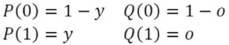
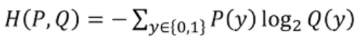
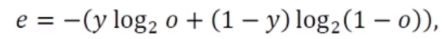
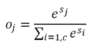

# [Week10 - Day2] Deep Learning 14 - 최적화 1

## 1. 미리보기
  - 머신 러닝의 최적화
    - Train Set으로 학습을 마친 후, 현장에서 발생하는 새로운 샘플 예측 -> 일반화 능력이 좋아야 함
  - 어려운 이유
    - 대리자 관계
    - 매개 탐색 공간에서 목적함수의 비블록 성질, 고차원 특징 공간, 데이터의 희소성 등
    - 긴 훈련 시간

## 2. 목적함수 : 교차 엔트로피와 로그우도
  - 성능 판정의 중요성

### 2-1 Mean Square Error (MSE, 평균 제곱 오차)
  - MSE
    - *e* = 1/2 * ||**y** - **o**||22
    - 오차가 클수록 *e*값이 크므로 벌점으로 활용됨
  - 큰 허점 존재
    - 학습은 오류를 줄이는 방향으로 가중치와 편향을 교정
    - *wx* + *b* 가 커지면 경사도가 작아짐
    - 큰 교정이 필요한 경우에도 작은 경사도로 작게 갱신
    
### 2-2 교차 엔트로피
  - 교차 엔트로피
    - 정답에 해당하는 *y* 확률변수
    - 확률 분포 P : 정답, Q : 신경망 예측
    - 
    - 
  - 목적함수
    - 
    - 오류가 더 클수록 큰 경사도

### 2-3 소프트맥스 활성함수, 로그우도 목적함수
  - softmax
    - 
    - max를 모방
    - 중간 계산 결과의 최댓값을 더욱 많이 활성화, 다른 작은 값을 억제
    - 모두 더하면 1 -> 확률 모방
  - 음의 로그우도
    - *e* -log2*o**y*
    - 모든 출력 노드값을 사용하는 대신 하나의 노드만 적용
    - *oy*는 샘플의 정답에 해당하는 노드의 출력값
  - Softmax + Negative log-likelihood
    - softmax - 최댓값이 아닌 값을 억제
    - 음의 로그우도 - 정답에 해당하는 노드에 집중
    - 따라서 둘을 결합하여 사용하는 경우가 많음 
    - Hinge loss, MSE 대비 성능이 더 높음
  - 소프트맥스 분류기 (Softmax Classifier)
    - 다항 로지스틱 회귀 분석
    - 분류기의 최종 값을 확률로 표현
    - 소프트맥스 + 로그우도