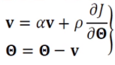
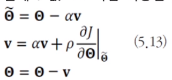
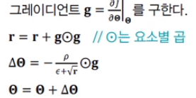
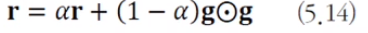

# [Week10 - Day2] Deep Learning 15 - 최적화 2

## 1. 성능 향상 방법
### 1-1 데이터 전처리
  - 규모 (Scale) 문제
    - ex) 키와 몸무게
      - 키의 차이보다 몸무게의 차이가 스케일이 더 커서 학습에 더 많이 영향
    - 스케일을 비슷하게 맞춰줌으로써 전체 데이터가 고루 영향을 끼칠수 있도록 조정
  - 모든 특징이 양수인 경우 - 양수 문제
    - 가중치가 번들로 증가 or 감소
    - 최저점을 찾는 경로 혼동으로 수렴 속도 ↓
  - 정규화
    - 규모 문제 + 양수 문제 해결
    - 특징별로 독립적으로 적용
  - One-Hot Encoding
    - 명목 변수를 원핫코드로 변경
      - 명목 변수 : 객체간 서로 구분을 위한 변수, 거리 개념 X
      - one-hot : 값의 개수만큼 비트를 부여

### 1-2 가중치 초기화
  - 대중적 가중치 문제
    - 가중치가 대칭이 되면 두 노드가 같은 일을 하는 중복 발생
    - 난수로 초기화하여 대칭을 제거
  - 난수 가중치
    - Gaussian, uniform 분포에서 난수 추출 -> 성능 차이 거의 없음
    - 난수 범위 중요
    - 편향(바이어스)는 0으로 초기화
  - 기타 방법
    - Saxe 2014 - 가중치 행렬의 행 or 열이 수직이 되도록 설정
      - 분포를 통한 난수로 기본설정후 특이 분해를 통해 가중치 조정
    - Sussillo 2014 - 임의 행로(random walk) 활용
    - sutskever 2013 - 가중치와 모멘텀을 동시에 최적화
    - mishkin 2016 - 가중치 분포가 아닌 노드의 출력값 분포가 일정하도록 강제
      1. 수직 규칙을 적용하여 가중치를 초기화
      2. 미니배치 하나를 사용하여 전방 계산을 수행하면서 노드 출력값의 분산이 1이 될때까지 조정

### 1-3 모멘텀
  - 경사도의 잡음
    - 머신러닝은 Train Set을 이용하여 파라미터의 경사도를 추정 -> 잡음 가능성 높음
    - 모멘텀은 경사도에 스무딩을 가하여 잡음 효과를 줄임
      - local minima에 빠지는 문제 해소
  - 모멘텀을 적용한 가중치 갱신
    - 
    - 속도 벡터 **v** : 이전 경사도 누적 (초기값 0에서 출발)
    - \alpha : 모멘텀의 정도
      - 0이면 모멘텀 적용 X
      - 1에 가까울 수록 이전 경사도 정보에 큰 가중치
      - 보통 0.5, 0.9, 0.99
        - 초기값 0.5에서 시작 -> 세대가 지남에 따라 0.99에 도달
  - 모멘텀 효과
    - 지나침(Overshooting) 현상 완화
  - Nesterov Accelerated Gradient (네스테로프 가속 경사도) 
    - 현재 속도 벡터 값을 통해 다음 이동할 곳의 \theta를 예측
    - 예측한 곳의 경사도를 사용 -> 멈추기에 용이
    - 

### 1-4 적응적 학습률 (Adaptive Learning Rate)
  - 학습률의 중요성
    - 너무 크면 오버슈팅에 따른 진자현상, 너무 작으면 수렴 속도 ↓
  - 적응적 학습률
    - 학습률 * 경사도
    - 파라미터마다 상황에 맞게 학습률을 조절
    - Stimulated-anhealing (SA, 학습률 담금질)
      - 이전 경사도와 현재 경사도의 부호가 같은 파라미터는 값을 증가
      - 다른 파라미터는 값을 감소
  - AdaGrad(Adaptive Gradient)
    - 목표에 수렴하도록 학습률을 감소
    - 
    - 위를 \hat(\theta)가 0이 될때까지 반복
    - **r**은 이전 경사도를 누적한 벡터
      - *r*이 크면 갱신값이 작아서 짧게 이동
      - *r*이 작으면 갱신값이 커서 멀리 이동
    - 상황에 따라 보폭을 정하는 적응적 학습률
      - \epsilon : 분모가 0이 되는것을 방지
    - 단점
      - 경사도의 단순 제곱을 더함 -> 오래된 경사도와 최근 경사도가 같은 비중을 가짐 -> **r**이 점점 커져서 수렴을 방해할 수 있음
  - RMSProp
    - 가중 평균 이동 기법
    - 
    - \alpha가 작을수록 최근 값에 비중을 크게 줌
      - 보통 0.9, 0.99, 0.999 사용
  - Adam (Adaptive Momentum)
    - RMSProp에 모멘텀을 추가로 적용