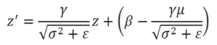
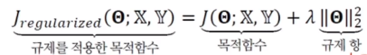
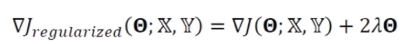
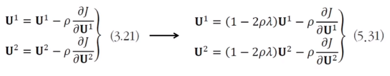

# [Week10 - Day3] Deep Learning 16 - 최적화 3

## 1. 성능 향상 방법
### 1-5 활성함수
  - 선형 연산 결과에 비선형 활성함수 \tau를 적용
  - 종류
    - 선형
    - 계단 (Step)
    - tanH
    - Sigmoid 
      - 활성값이 커지면 포화 상태 -> 경사도가 0에 가까운 값 -> 학습 속도 저하
    - ReLU
      - 경사도 포화 문제 해소
      - y = ReLU(z) = max(0, z)
      - 변형
        - Leaky ReLU (\alpha는 보통 0.01)
        - Parametic ReLU (\alpha를 학습을 통해 탐색)
    - Maxout
    - ELU (Exponential Linear Units)

### 1-6 배치 정규화
  - 공변량 변화 현상
    - 훈련집합과 테스트집합의 분포가 다름
    - 내부의 공변량 변화
      - 학습이 진행되면서 1층의 파라미터가 바뀜 -> 2층 입장에서는 입력되는 데이터가 수시로 변화
      - 층이 깊어짐에 따라 영향이 더 커짐 -> 학습 방해 요인으로 작용
  - 정규화를 층 단위로 적용
    - 내부 공변량 변화 현상 해소
    - 정규화 적용 위치가 중요 -> 일반적으로 FC층, Conv층 이후 or 비선형 함수 이전에 적용
    - 미니배치에 적용하는 것이 유리
  - 과정
    1. 미니배치 단위로 평균과 분산 계산
    2. 구한 평균, 분산을 통해 정규화
    3. 비례와 이동으로 세부조정
  - 장점
    - 신경망의 경사도 흐름 개선
    - 높은 학습률 허용
    - 초기화에 대한 의존성 감소
    - 규제와 유사한 동작, 드롭아웃 필요성 감소
  - 최적화 이후 후처리
    - 각 노드는 전체 훈련집합을 사용하여 평균,분산,비례,이동을 저장
  - 예측
    - 각 노드는 독립적으로 아래식을 적용하여 변환
    - 
    - 정규화 + 세부조정의 실행과 동일
  - CNN
    - 노드 단위가 아닌 특징 맵 단위로 적용
      - p*q 특징맵 -> 미니배치 샘플마다 pq개의 값이 발생
      - pqm 개의 값을 통해 평균과 분산 계산
      - 특징 맵마다 비례값과 이동값이 하나씩 존재
    - loffe2015 - 배치 정규화의 긍정 효과를 측정
      - 가중치 초기화에 덜 민감
      - 학습률을 크게하여 수렴 속도 향상
      - sigmoid를 사용하는 DNN도 학습이 이루어짐
      - 규제 효과로 드롭아웃 적용 필요 X

## 2. 규제의 필요성과 원리
### 2-1 과잉적합의 이유와 회피 전력
  - 학습 모델의 용량이 클 수록 일반화 능력 ↑
  - 대부분 데이터 대비 훨씬 큰 용량의 모델을 사용
    - 훈련집합을 단순히 암기하는 상황이 발생할 수 있음
  - 현대의 머신러닝 전략
    - 충분히 큰 용량의 모델을 설계하고 학습과정에서 여러 규제 기법을 적용

### 2-2 규제의 정의
  - 오래전부터 수학과 통계학에서 연구해온 주제
  - 모델 대비 데이터가 부족한 경우의 부족조건문제에 대한 접근법
    - 적절한 가정을 투입하여 문제를 해결 -> 입력과 출력사이의 변환은 매끄러움
    - 유사한 데이터는 가깝게 매핑
  - 티호노프의 규제(Tikhonov's Regularization)
    - 매끄러움 가정에 기반
    - 릿지 회귀, 가중치 감쇠
  - 현대 머신러닝
    - 매끄러움 가정 사용
      - 가중치 감쇠
        - 모델의 구조적 용량을 충분히 크게 하고 수치적 용량을 제한
      - 비지도 학습
  - 딥러닝
    - 일반화 오류를 줄이려는 의도를 가진 모든 알고리즘

## 3. 규제 기법
  - 명시적 규제 : 가중치 감쇠, 드롭아웃 등 목적함수나 신경망 구조를 직접 수정
  - 암시적 규제 : 조기 멈충, 데이터 증대, 잠음 추가, 앙상블 등 간접적으로 영향

### 3-1 가중치 벌칙
  - 규제를 적용한 목적함수 = 목적함수 + 규제항
  - 규제항은 훈련집합과 무관, 데이터 생성 과정에 내재한 사전 지식
  - 파라미터를 작은 값으로 유지하여 모델의 용량을 제한
  - 규제항으로 사용할 값
    - 큰 가중치에 벌칙 -> 작은 가중치를 유지
    - 주로 L2 Norm, L1 Norm 사용
  - 가중치 감쇠 : L2 Norm을 규제항으로 사용
    - 
    - 경사도 계산
      
    - \theta에 (1 - 2 * \law * \lambda)를 곱함
    - 최종해를 원점 가까이 당기는 효과 -> 가중치를 작게 유지
    - 선형 회귀에 적용
      - L1 규제 : Lasso Regression
      - L2 규제 : Ridge Regression
    - MLP, DMLP에 적용
      - 
  - L1 Norm
    - 희소성 효과 : 0이 되는 파라미터가 많음
      - 선형 회귀에 적용 시 특징 선택 효과
  - Elastic Net
    - L1 + L2
  - 효과
    - 가중치에 대한 선호도 표현
    - 학습 모델을 단순화 -> 일반화 성능 향상
    - 매끄러움 가정을 통해 최적화 개선
  
### 3-2 조기 멈춤
  - 학습에 일정 시간이 지나면 과잉적합 현상 발생
    - 훈련 데이터의 단순 암기
  - 검증오류가 최저인 점에서 학습을 정지
  - 단순 조기 멈춤
    - 진자 현상 고려 X
    - local minima에 수렴 가능성
  - 참을성 반영
    - 참을성 : 연속적으로 성능 향상이 없으면 멈춤

### 3-3 데이터 확대
  - 큰 훈련집합
    - 과잉 적합을 방지하는 가장 확실한 방법 
    - 데이터 수집에 많은 비용 필요
  - 데이터 확대
    - 데이터를 인위적으로 변형하여 데이터 량을 확대
    - 자연에서 벌어지는 잠재적 변형을 모방
    - 한계
      - 수작업
      - 모든 클래스가 같은 변형을 사용
  - 모핑
    - 비선형 변환 -> Affine 변환에 비해 훨씬 다양한 형태의 변환
    - 학습 기반 -> 데이터에 맞는 비선형 변환 규칙을 학습

