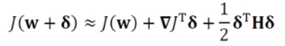

# [Week10 - Day3] Deep Learning 17 - 최적화 4

## 1. 규제 기법
### 1-4 드롭아웃
  - FC층의 노드 중 일정 비율을 임의적으로 제거
    - 남은 부분의 신경망 학습
  - 많은 부분 신경망을 만들고 앙상블 결합하는 기법으로 볼 수 있음
  - 의미를 더욱 부각
  - 예측 단계
    - 앙상블 효과 모방
      - 가중치가 드롭아웃 비율을 제외한 나머지만 참여 -> p만큼 보정
  - 메모리와 계산 효율
    - 추가 메모리는 boolean 배열 \pie, 추가 계산 작음
    - 실제 부담은 신경망의 크기가 원인

### 1-5 앙상블
  - 여러 모델을 결합하여 일반화 오류를 줄이는 기법
  - 두 가지 일
    1. 서로 다른 예측기의 학습
      - 다른 구조의 신경망 여러개, 같은 구조에 다른 초기값+하이퍼파라미터
      - 배깅 : 훈련집합을 여러번 샘플링하여 서로 다른 훈련집합을 구성
      - 부스팅 : 한 예측기가 틀린 샘플을 다른 예측기가 잘 인식하도록 연계
    2. 학습된 예측기들을 결합
      - 여러 모델의 출력에서 평균을 구하거나 투표를 통해 최종결과 결정

## 2. 하이퍼파라미터 최적화
  - 학습 모델에는 두 종류의 파라미터 존재
    - 내부 파라미터 = 가중치
      - 학습 알고리즘이 최적화
    - 하이퍼파라미터
      - 모델의 외부에서 모델의 동작을 조정
      - 사람에 의해서 결정
      - 은닉층의 개수, CNN 필터의 크기, 보폭, 학습률 등
  - 선택
    - 표준 참고 문헌에서 제시하는 기본값 사용
      - 여러 후보를 제시
    - 후보 중에서 주어진 데이터에 최적인 값을 선택
    - 최근 학습을 통한 자동 탐색법들이 연구됨
  - 탐색
    - 격자 탐색
    - 임의 탐색
      - 난수로 하이퍼파라미터 조합을 생성
    - 로그 공간 간격으로 탐색
    - 차원의 저주 문제 발생
    - 임의 탐색이 성능 ↑
    - coarse-fine 탐색
      - 간격을 크게 시작하여 점차 세밀하게 변경

## 3. 2차 미분을 이용한 최적화
  - 경사 하강법 리뷰
    - 1차 미분을 사용
    - 현재 머신러닝의 주류 알고리즘
    - 개선
      - 경사도의 잡음을 줄임 (미니배치)
      - 2차 미분 활용
    - 더욱 빠른 경사 하강법에 대한 의문
      - 1차 미분으로는 탐색 불가능
  - 1차 미분, 2차 미분 비교
    - 1차 미분
      - 경사도를 사용하여 선형 근사 사용
      - 근사치의 최소화
    - 2차 미분
      - 경사도와 헤시안을 사용하여 2차 근사 사용
      - 근사치의 최소값
  - 뉴턴 방법
    - 테일러 급수 적용
      - 주어진 함수를 정의역에서 특정 점의 미분계수들을 계수로 가지는 다항식의 극한으로 표현
      - 
      - w + \delta를 최소점으로 가정
        - 
      - 정리 후 확장
        - 
    - 적용
      - 머신러닝의 목적함수는 2차 함수보다 복잡 -> 한번에 최적해 도달 불가능
      - 반복하는 뉴턴 방법 사용
      - 헤시안 **H** 계산 필요
        - m개 파라미터에 대해 *O*(m3) 연산량 필요
  - 켤레 경사도 방법
    - 직선 탐색
      - 이동 크기를 결정하기 위해 직선으로 탐색, 미분
    - 직진 정보를 사용하여 해에 빨리 접근 가능
  - 유사 뉴턴 방법 (Quasi Newton Method)
    - 문제점
      - 경사 하강법 : 수렴 효율성 낮음
      - 뉴턴 방법 : 헤시안 행렬 연산 부담
    - 점진적으로 헤시안을 근사화하는 LFGS를 많이 사용
    - 머신러닝에서는 **M**을 저장하는 메모리를 적게 한 L-BFGS를 주로 사용
      - 전체 배치를 통한 갱신
  - 현재 널리 활용 X, 지속적인 연구 중