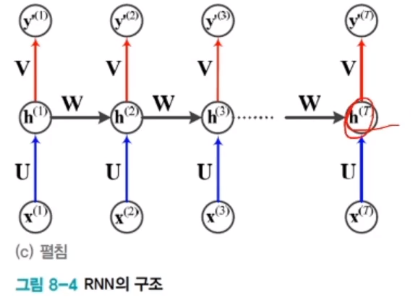
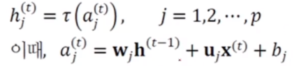
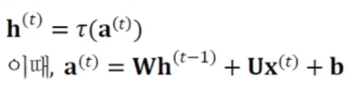
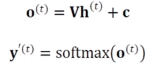
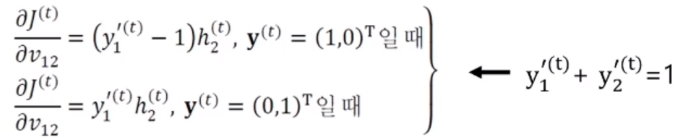
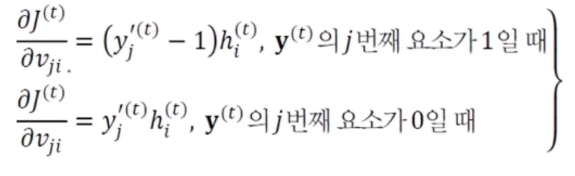
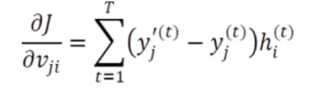
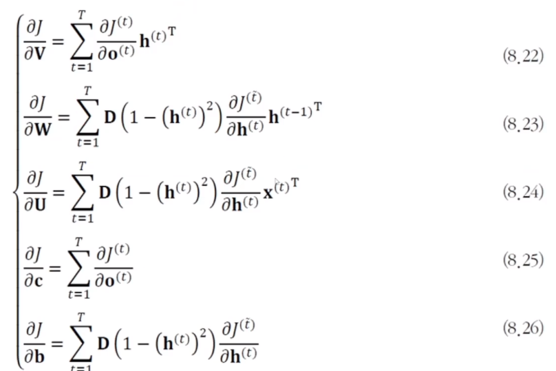

# [Week10 - Day4] Deep Learning 18 - RNN

## 1. 미리보기
  - 시간성 데이터
    - 순차 데이터 : 특징이 순서를 가짐
    - 동적이며 보통 가변 길이
  - 순환 신경망(RNN)과 LSTM
    - 순환 신경망
      - 시간성 정보를 활용하여 순차 데이터를 처리하는 효과적인 학슴 모델
    - LSTM
      - 매우 긴 순차 데이터 처리에는 장기 의존성을 잘 다루는 능력이 필요
      - 선별 기억 능력을 가짐
  - 최근에는 생성 모델로도 사용

## 2. 순차 데이터
  - 응용
    - 심전도 신호 분석
    - 주식 시세 분석
    - 음성인식
    - 기계 번역
    - 유전자 열 분석을 통한 치료 계획 수립

### 2-1 표현
  - 예시
    - 온라인 숫자
    - 3채널 심전도 신호
  - 일반적 표기
    - 벡터의 벡터 (벡터를 요소로 가지는 벡터)
    - 숫자 -> 1차원, 심전도 -> 3차원
  - 훈련집합 **X**, **Y**
    - 각 샘플은 **x** = (**x**(1), ... , **x**(*T*))*T*의 형태로 표현
  - 문자열의 표현
  - 사전을 사용하여 표현
    - 사전 구축 방법
      - 사람이 사용하는 단어를 모아 구축
      - 주어진 말뭉치를 분석하여 단어를 자동 추출하여 구축
    - 텍스트 순차 데이터의 표현
      - 단어가방 (BoW)
        - 단어 각각의 빈도수를 세어 m차원의 벡터로 표현
        - 한계 : 정보 검색에 주로 사용되지만, 머신러닝에는 부적절
          - 같은 특징 벡터로 표현 -> 시간성 정보 사라짐
      - 원핫 코드 (One-hot)
        - 해당 단어의 위치만 1로 표시
        - 한계
          - 한 단어를 표현하는 m차원 벡터를 사용 -> 비효율적
          - 단어 간의 유사성 측정할 수 없음
      - 단어 임베딩 (Word Embedding)
        - 단어 사이의 상호작용을 분석하여 새로운 공간으로 변환
          - 보통 m보다 훨씬 낮은 차원으로 변환
        - 변환과정은 학습이 말뭉치를 훈련집합으로 사용하여 검색
        - ex) word2vec -> 30000차원 -> 620차원

### 2-2 특성
  - 특징이 나타내는 순서가 중요
    - 아버지가 방에 들어가신다 -> 아버지 가방에 들어가신다
    - 비순차 데이터는 순서를 바꿔도 무방
  - 샘플마다 길이가 다름
    - 순환 신경망은 은닉층에 순환 연결을 부여하여 가변 길이 수용
  - 문맥 의존성
    - 비순차 데이터는 공분산이 특징 사이의 의존성을 나타냄
    - 순차 데이터에서는 공분산 의미 X, 문맥 의존성이 중요
      - 간격이 크면 장기 의존성

## 3. Recurrent Neural Network(RNN, 순환신경망)
  - 필수 기능
    - 시간성 : 특징을 순서대로 한번에 하나씩 입력
    - 가변 길이 : 길이가 T인 샘플 -> 은닉층이 T번 나타나야함
    - 문맥 의존성 : 이전 특징 내용을 기억하고 있다가 적절한 순간에 활용

### 3-1 구조
  - 구조
    - DNN과 유사
      - 입력, 은닉, 출력
    - 은닉층이 순환 연결을 가짐 (DNN과 차이)
      - 시간성, 가변길이, 문맥 의존성을 모두 처리
      - 순환 연결은 *t*-1 순간에 발생한 정보를 *t* 순간으로 전달하는 역할
  - 수식으로 표현
    - *t*=1 순간에 계산, 그 결과를 가지고 t=2 순간에 계산
    - 일반적으로 t 순간에는 t-1 순간의 은닉층 값과 t순간의 입력을 받아 계산
    - \theta는 순환 신경망의 파라미터
    - 
  - 파라미터
    - **U** : 입력층 - 은닉층
    - **W** : 은닉층 - 은닉층
    - **V** : 은닉층 - 출력층
    - **b**, **c** : 바이어스
    - RNN 학습 : 훈련집합을 최적의 성능으로 예측하는 \theta를 탐색
  - 파라미터 공유
    - 매 순간 같은 값을 공유
    - 장점
      - 추정할 파라미터의 수 감소
      - 파라미터의 수가 특징 벡터의 길이와 무관
      - 특징이 나타나는 순간 뒤바뀌어도 같거나 유사한 출력 생성 가능

### 3-2 동작
  - 가중치
    - **U**, **V**, **W**
  - 은닉층의 계산
    - 
    - MLP와 유사 (**w**j**h**(t-1) 항 제외하면 MLP와 동일)
    - 행렬 표기로 표현
      - 
  - 출력층의 계산
    - 
  - RNN의 기억과 문맥 의존성
    - **x**(1)의 변화 -> 상태 **h**가 변화 -> 출력 **y**가 변화
    - **x** 끼리 상호작용 -> 문맥의존성
    - 기억의 지속시간 -> 장,단기 문맥 의존성

### 3-3 BackPropagation Through Time (BPTT) 학습
  - 훈련집합 **X**, **Y**
    - **x**. **y**는 길이가 *T*와 *L*인 시간성 데이터
  - RNN과 DMLP의 비교
    - 유사성
      - 입력, 은닉, 출력층 보유
    - 차이점
      - RNN은 샘플마다 은닉층의 수가 다름
      - DMLP는 왼쪽에 입력, 오른쪽에 출력, RNN은 매순간마다 입력과 출력이 존재
      - RNN은 가중치를 공유
  - 목적함수의 정의
    - MSE, 교차엔트로피, 로그우도 중에 선택하여 사용
  - 경사도 계산
    - 로그우도로 가정
    - **y**(t) = (1,0)T와 (0,1)T 경우로 나눠서 진행
      - 
    - 일반화
      - 
    - 정리후 매 시간에 대한 고려 추가
      - 
  - BPTT 알고리즘
    - 위 식을 행렬 **V** 전체로 확장, **U**, **W**, **b**, **c**에 대해 모두 유도
    - 은닉층에서의 미분
      - 순간 t의 은닉층값 **h**의 미분 -> 그 이후의 은닉층과 출력층에 영향 -> **V**로 미분보다 복잡
    - 

### 3-4 양방향 RNN
  - 양방향 문맥 의존성
    - 단방향 RNN의 한계 : 정보가 한 방향으로만 흐름
  - 양방향 RNN
    - *t* 순간의 단어는 앞쪽과 뒤쪽 단어 정보를 모두 보고 처리
    - 기계 번역에서도 BRNN 활용