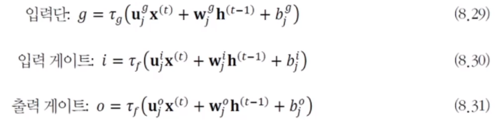
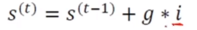
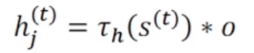

# [Week10 - Day4] Deep Learning 19 - RNN 2

## 1. 장기 문맥 의존성
  - 관련된 요소가 멀리 떨어진 상황
  - 문제점
    - 경사 소멸, 경사 폭발
    - RNN은 DMLP나 CNN보다 심각
      - 긴 입력 샘플이 자주 발생
      - 가중치 공유로 인해 같은 값을 계속 곱함
  - LSTM - 가장 많이 사용하는 해결책

## 2. LSTM (Long Short Term Memory)
### 2-1 게이트를 이용한 영향력 범위 확장
  - 입력 게이트, 출력 게이트
    - 게이트를 열면 신호가 흐르고, 닫으면 차단
  - 핵심요소
    - 메모리 블록 (셀) : 은닉 상태 장기 기억
    - 망각 게이트 : 기억 유지 혹은 제거
    - 입력 게이트 : 입력 연산
    - 출력 게이트 : 출력 연산
  - RNN과 비교
    - 메모리 블록을 통한 효율 증가
  
### 2-2 동작 
  - 동작
    - LSTM에서 출력 게이트와 입력 게이트의 값이 1.0으로 고정되면 RNN과 동작
    - 가중치와 신호 값에 따라 계패 정도를 조절
  - 입력, 입력 게이트, 출력 게이트에서의 계산
    - 
    - *g, i, o* 값은 가중치 **u**, **w**, 현재 순간의 입력벡터 **x**, 이전 순간의 상태 **h**에 따라 결정
    - \tau*g*는 tanh, \tauf는 sigmoid를 주로 사용
  - 아래쪽 곱 기호는 개폐를 조절
    - 입력 게이트의 값이 0.0에 가깝다면 g*i를 0에 가깝도록 차단, 1.0에 가깝다면 값을 그대로 전달하는 효과
  - / 기호 : 메모리 블록의 상태
    - 메모리 블록이 기억하는 내용으로 시간에 따라 변화, *s*(t)로 표기
      - 
  - 위쪽 * 기호 : 개폐를 조절
    - 출력 게이트의 값이 개폐 정도를 조절
    - 
  - 계산 결과 *h**j*(*t*)
    - *Q*개의 출력 노드로 전달 -> 출력단 계산에 사용
    - 입력단, 입력 게이트, 출력 게이트에 있는 노드로 전달 t+1 순간의 계산에 이용
  - 확장
    - stacked LSTM
### 2-3 망각 게이트와 작은 구멍(핀홀)
  - 망각 게이트에 의한 LSTM의 확장
    - 이전 순간의 상태 *h*를 지우는 효과
  - 핀홀 기능으로 LSTM 확장
    - 블록의 내부 상태를 3개의 게이트에 알려주는 역할
    - 순차 데이터를 처리하다가 어떤 조건에 따라 특별한 조치를 취해야 하는 응용에 효과적
      - 음성 인식을 수행하다가 특정 단어가 발견되면 지정된 행위를 수행

## 3. 응용 사례
  - RNN은 생성 모델로도 활용
  - LSTM은 장기 문맥을 처리하는데 유리

### 3-1 언어 모델
  - 문장의 확률분포를 모형화
  - 활용
    - 음성 인식기, 언어 번역기가 후보로 출력한 문장들에 대해 언어 모델을 통해 확률을 계산 후 확률이 가장 높은 것을 선택하여 성능을 향상
  - 확률분포 추정
    - n-그램
    - 다층 퍼셉트론
    - 순환 신경망
  - n-그램 언어 모델
    - 고전적인 방법
    - 문장을 **x**로 가정 -> **x**가 발생할 확률을 추정
    - n-1 개의 단어만 고려
      - 알아야 할 확률의 개수는 mn -> 차원의 저주로 인해 1~3정도로 작게 설정
      - 확률 추정 : 말뭉치 사용
    - 단어가 원핫 코드로 표현 -> 단어 간의 의미 있는 거리를 반영 불가
  - RNN 언어 모델
    - 현재까지 본 단어 열을 기반으로 다음 단어를 예측하는 방식으로 학습
    - 비지도 학습 -> 말뭉치로부터 쉽게 훈련집합 구축
      - 단어가 왼쪽으로 이동하면서 샘플이 됨
    - RNN의 학습
      - 말뭉치의 문장을 변환하여 훈련집합 생성, BPTT 알고리즘을 적용
    - 활용
      - 기계 번역기, 음성 인식기의 성능 향상에 활용
    - 사전학습을 수행한 언어 모델을 개별 과제에 맞게 미세 조정
      - 생성 모델로 활용 [Karpathy2015]
  - 주요 모델
    - ELMo
    - BERT
    - GPT
  
### 3-2 기계 번역
  - 언어 모델보다 어려움
    - 언어 모델은 입력과 출력의 길이가 동일
    - 기계 번역은 길이가 서로 다른 열 대 열 문제
    - 어순이 다른 문제
  - 고전적인 통계적 기계번역 방법의 한계 -> DNN 기반 기계 번역 방법이 주류
  - LSTM을 사용하여 번역 과정 전체를 통째로 학습
    - LSTM 2개를 사용(인코더 - 디코더)
    - 인코더
      - 원시언어 문장을 특징벡터로 변환
    - 디코더
      - 특징벡터를 가지고 목적 언어 문장을 생성
    - 가변 길이의 문장을 고정 길이의 특징벡터로 변환한 후, 고정 길이에서 가변 길이 문장을 생성
      - 문장 길이가 크게 차이나는 경우 성능 저하
    - 모든 순간의 상태 변수를 사용
      - 양방향 구조를 채택하여 어순이 다른 문제를 해결

### 3-3 영상 주석 생성
  - 영상 속 물체를 검출, 인식 -> 물체의 속성과 행위, 물체간의 상호 작용 탐색
  - DNN 접근법
    - CNN으로 영상을 분석, 인식 + LSTM은 문장을 생성
    - 훈련집합
      - x는 영상, y는 영상을 기술하는 문장
    - CNN
      - 입력 영상 x를 단어 임베딩 공간의 특징 벡터로 변환
    - y의 단어 z는 단어 임베딩 공간의 특징벡터 z로 변환됨
      - **E**는 통째 학습 과정에서 CNN, LSTM고하 동시에 최적화
    - 입력
      - **X**를 CNN에 입력
      - 문장을 임베딩 공간의 점으로 변환하여 LSTM에 입력
    - 목적함수
      - LSTM의 출력과 문장이 일치할수록 성능이 좋은것
      - 로그우도를 통한 일치 정도 평가
    - 최적화할 파라미터 집합
      - CNN 파라미터
        - FC층의 가중치
      - LSTM 파라미터
        - **U**, **W**
      - 단어 임베딩 파라미터
        - **E**
      - 3개를 \theta로 묶어 한꺼번에 최적화
  - 사례
    - 영상 주석 생성
    - 영상 질의 응답