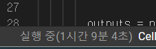
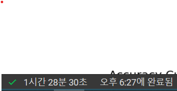

# [Week12 - Day6] Monthly 3 - CNN

## 데이터셋
  - https://github.com/ndb796/Scene-Classification-Dataset-Split

## CustomLeNet
  - CUDA 썼더니 왜 CUBLAS 어쩌고 저쩌고 에러?
    - 계산 실수 였음...
  
## AlexNet
  - CUDA 써도 시간 드럽게 걸리네 진짜
  - 정확도 : 83.3%

## LightResNet
  - 32 
    - 학습 시간 877초 = 14분 37초
    - 정확도 83.5%
  - 56 
    - 학습 시간 1514초 = 25분 14초
    - 정확도 86.9%
  - 110
    - 학습 시간 2918초 = 48분 38초
    - 정확도 84.2%

  - 
    - 다음에는 좀 빨리 끝나는 내용으로 좀...
  - 
    - 이건 너무한거 아니냐고~

  - [(83.53390079248605, 0.014205529043707359),
     (86.90930437334899, 0.0114259006827851), 
     (84.23833284414441, 0.013890624529618407)]

## 테트리스
  - 1등!
  - 손 떨려서 질뻔했네

## Mixup + Transfer
  - 1바퀴에 160초
  - 30번 돌림
  - 96퍼 찍었는데... 런타임 시간 초과....
