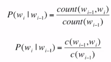

# [Week13 - Day3] NLP 2

## 1. 언어모델
  - 목표 : 문장이 일어날 확률을 계산
  - 필요성
    - 기계 번역
    - 맞춤법 검사
    - 음성 인식
  - 연속적인 단어에 확률을 부여하는 모델
    - 연속적인 단어가 주어졌을때 그 다음 단어의 확률을 계산
  - 결합확률 계산
    - Chain rule
      - 조건부 확률 $P(w|h)$
      - 문제점
        - 가능한 문장의 개수가 너무 많음
        - 계산할 수 있는 충분한 양의 데이터 X
      - Markov Assumption
        - 한 단어의 확률은 그 단어 앞에 나타나는 몇 단어에만 의존
  - Unigram 모델
    - $P(w_{1}w_{2}, ..., w_{n})\approx \prod_{i}P(w_{i})$
  - Bigram 모델
    - $P(w_{i}|w_{1}w_{2}, ..., w_{i-1})\approx P(w_{i}|w_{i-1})$
  - N-gram 모델
    - Unigram, Bigram 확장
    - 멀리 떨어진 단어들간의 관계를 완벽하게 모델링 X
    - 많은 경우에 대해 좋은 결과를 얻을 수 있음
    - 확률 계산 (Bigram 기준)
      - Maximum Likelihood Estimation (MLE)
        - 
  - 모델 평가
    - 외재적 평가
      - 모델 자체가 목표가 아닌 과제를 위한 부분으로서 사용
      - 과제의 평가지표를 사용하는 경우가 많음
    - 내재적 평가
      - 외재적 평가는 시간이 오래 걸림
      - 언어모델이 학습하는 확률자체를 평가 (Perplexity)
      - 이 기준의 최적 언어모델이 과제에서 최적 언어모델이 아닐수 있음
      - 언어모델의 학습과정에 버그가 있는지 빠르게 파악하는 용도로 사용 가능
    - 좋은 언어모델?
      - 테스트 데이터를 높은 확률로 예측
      - Perplexity : 확률의 역수를 단어의 개수로 정규화
      - Perplexity의 최소화 -> 확률의 최대화