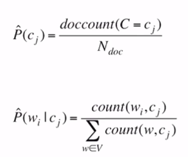

# [Week13 - Day4] NLP 3 - 문서분류

## 1. 문서분류
  - 텍스트를 입력받아 텍스트가 어떤 종류의 범주에 속하는지 구분하는 작업
  - 부류
    - 문서의 범주, 주제 분류
      - 논문
    - 이메일 스팸 분류
    - 감성 분류
      - 리뷰
    - 언어 분류

## 2. 감성 분류
  - 사용처
    - 영화, 제품, 정치, 예측
  - 감성의 여러 측면이 존재 -> 간단한 작업에 집중
    - 감정적, 태도적, 성격적 측면
    - 긍정의 태도, 부정의 태도

## 3. 문서 분류
  - 방법
    - 규칙 기반 모델
      - 단어들의 조합을 사용한 규칙들을 사용
        - spam
      - Precision은 높지만 Recall 낮음
      - Snorkel
        - 각각의 규치을 labeling function으로 간주
        - Factor Graph를 사용해서 확률적 목표값을 생성하는 Generative Model
        - labeled data가 부족하거나 클래스 정의 자체가 애매한 경우에 유용
        - 확률적 목표값이 생성된 후에는 딥 모델 등 다양한 모델을 사용가능
    - 지도 학습
      - Naive Bayes
        - Naive-Bayes 가정 + Bag of Words 표현에 기반
      - Logistic Regression
      - Neural Network
      - K-Nearest Neighbors
      - 기타

## 4. Naive-Bayes
  - Naive-Bayes 분류기 -> 입력값에 관한 선형 모델
  - Bag of Words : 위치는 확률에 영향 X
  - MLE
    - 
  - 적은 학습 데이터로도 좋은 성능
  - 빠른 속도
  - 문서 분류의 베이스라인으로 적합