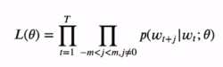
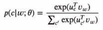
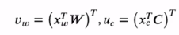
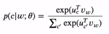

# [Week13 - Day5] NLP 4 - 단어 임베딩

## 1. 단어 임베딩
  - 단어의 의미를 어떻게 나타낼 것인가
    - 글자의 나열
    - One-Hot Encoding
    - 좋은 표현방식은 단어간의 관계를 잘 표현할 수 있어야 함
  - 단어의 의미
    - 어근 (Lemma)
    - 어미 (Sense)
  - 동의어
    - 문맥상 같은 의미를 가지는 단어들
    - 항상 대체할 단어가 있는 것은 아님
  - 유사성
    - 유사한 의미를 가진 단어들 (동의어 제외)
  - 연관성
    - 의미의 유사성 외에도 다양한 방식으로 연관됨
    - Semantic Field
      - 특정한 주제나 영역(Domain)을 공유하는 단어들
      - 집 : {Door, Living Room, Window, Toilet, ...}
    - Semantic Frame
      - 특정 행위에 참여하는 주체들의 역할에 관한 단어들
      - 상거래 : {Buy, Sell, Pay, ...}
  - 벡터의 의미로 표현
    - 단어들은 주변의 환경 = 주변 단어들의 분포에 의해 의미가 결정
    - 단어의 의미를 분포적 유사성을 사용해 표현
    - 벡터 공간 내에서 비슷한 단어들은 가까이 위치
    - 이렇게 벡터로 표현된 단어를 임베딩(Embedding)이라 부름
    - 최근 NLP 방법은 모두 임베딩을 사용해서 단어의 의미를 표현
  - 임베딩의 이유
    - 사용하지 않는 경우
      - 각 속성은 한 단어의 존재 유무
      - 학습/테스트 간에 동일한 단어가 없으면 예측 결과가 안 좋음
    - 사용하면
      - 각 속성은 단어 임베딩 벡터
      - 테스트 때 새로운 단어가 나타나도 학습의 유사한 단어를 통해 학습한 내용이 유효

## 2. 종류
  - 희소벡터 (Sparse Vector)
    - tf-idf
    - Vector Propagation
  - 밀집벡터 (Dense Vector)
    - Word2vec
    - Glove
  - Term-Document 행렬
    - 각 문서는 단어들의 벡터로 표현
  - Word-Word 행렬 (Term-Context 행렬)
    - 주변 단어들의 빈도를 벡터로 표현
    - 벡터의 유사도 -> 코사인을 통해 계산 -> 코사인 유사도
  - TF-IDF
    - 단어의 빈도수를 그대로 사용할 때 문제점
      - 자주 나타나는 단어들(it, the, they, ...)은 의미를 구별하는 데 도움 X
      - 이런 단어들의 부작용을 최소화 필요
    - 문서 d 내의 단어 t의 새로운 가중치 값을 계산
      - $w_{t,d} = tf_{t,d} \times idf_{t}$
    - Term Frequency (TF)
      - $tf_{t,d} = \textup{count}(t,d)$
      - $tf_{t,d} = \log_{10}(\textrm{count}(t,d) 
      +1)$
    - Document Frequency (DF)
      - $df_{t}$ : 단어 t를 포함하는 문서들의 개수
      - Inverse DF (IDF) : $\textup{idf}_{t} = \log_{10}(\frac{N}{\textup{df}_{t}})$
        - N은 전체 문서 개수
  - Dense Vectors
    - tf-idf
      - 벡터가 길다 (V = 20000 ~ 50000)
      - 희소성 -> 대부분 원소가 0
    - Word2vec, Glove
      - 벡터가 짧다 (V = 50 ~ 1000)
      - 밀집성 -> 대부분 원소가 0이 아님
    - 선호되는 이유
      - 더 적은 파라미터 수
      - 더 좋은 일반화 능력
      - 동의어, 유사어 표현이 더 좋음

## 3. Word2vec
  - 주어진 단어 w를 인접한 단어의 빈도수 대신 주변 단어를 예측하는 분류기로 학습
    - 단어 w가 주어질 때 단어 c가 주변에 나타날 확률은?
  - 모델의 최종 예측 대신 모델 내 단어 w의 가중치 벡터에 주목
  - Self-Supervision (자가 지도학습)
    - 학습을 위한 목표값이 이미 데이터에 존재
    - 사람이 수동으로 라벨을 생성할 필요 x
  - Skip-Gram
    - 한 단어가 주어질 때 그 주변 단어를 예측할 확률 최대화에 목표
    - 파라미터를 명시화해서 우도 함수로 표현
      - 
      - 파라미터 $\theta = {W, C}$ 는 두 개의 임베딩 행렬 W, C를 포함
        - W : 목표(= 입력) 임베딩 행렬
        - C : 상황(= 출력) 임베딩 행렬
    - 목표 단어 w와 상항 단어 c에 대해 다음 확률 모델 가정
      - 
      - 이때 $x_{w}$ 를 w에 대한 원-핫 벡터로 가정
        - 
    - 문제점
      - 
      - 분모의 계산량이 많음 -> $|V|d$에 비례
    - 해결책
        - Noise-Constrastive Estimation : 분모를 하나의 파라미터로 학습 -> 이진 분류문제에 해당하느 새로운 목표함수 최적화 -> 파라미터들이 원래 우도의 최적해 근사
        - 더 단순화 하면 Negative Sampling이 됨
        - Word2vec은 Negative Sampling 사용