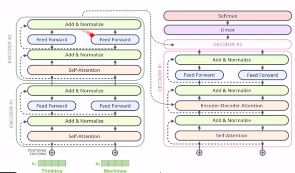

# [Week14 - Day2] NLP 5 - Transformer & BERT

## 1. NLP와 딥모델
  - RNN (LSTM)
  - TextCNN
  - Transformer
  - BERT (Transformer Encoder)
  - GPT (Transformer Decoder)

## 2. 종류
  - RNN
    - 문제점
      - 멀리 떨어진 단어들 간의 의존성 모델링 어려움
      - 순차적인 속성으로 인해 속도 느림
  - TextCNN
    - 여러 윈도우를 사용 (ex, 4, 5, 6)
  - Transformer
    - RNN, Convolution 사용 X
    - 오직 attention으로만 단어의 의미를 문맥에 맞게 잘 표현
    - 병렬화 가능
    - BERT, GPT 모델들의 기초
  
## 3. ML 모델 이해
  - 이해를 위한 순서
    - 모델이 풀려고 하는 문제
    - 추론 단계의 이해
      - 학습이 된 모델이 무엇을 입력으로 받아서 어떤 출력을 계산하는가
    - 무엇이 학습되는가 (모델 파라미터)
      - 파라미터오 입력, 둘의 함수 구분
    - 어떻게 학습되는가
      - 에러함수의 종류
  - Transformer
    - 추론 
      - Self-Attention
        - 단어의 의미는 문맥에 의해 결정 -> 같은 단어라도 문맥에 의해 뜻이 변화
        - 현재 단어의 의미를 주변 단어들의 의미의 조합으로 표현
        - 단어 임베딩 벡터 중심
          - Thinking - Machine
        - 행렬연산 표현
          - X : 입력
          - $W^{Q}, W^{K}, W^{V} $ : 모델 파라미터
          - Q, K, V : 입력과 파라미터에 관한 함수의 출력값
      - Multi-Headed attention
        - 다양한 attention Matrix들을 반영
      - Positional Encoding
        - 단어의 순서를 어떻게 표현할 것인가
      - Resuduals
        - add & Normalize
      - Encoder 종합
        - 
      - Decoder
    - 모델 학습

## 4. BERT
  - 문제
    - Transfer Learning을 통해 적은 양의 데이터로도 양질의 모델 학습
  - 추론
    - Fine-Tuned 모델
    - Pre-Trained 모델
      - Masked language Model
        - 마스킹을 통해 단어를 숨기고 숨겨진 단어를 예측
  - 모델 학습
    - Fine-Tuned
      - Pre-Trained 모델 파라미터를 기초로 새로운 작업을 위한 데이터(소량)를 사용해 파라미터를 업데이트
  - 응용
    - 문맥화된 임베딩 생성
    - Data Augmentation
      - 클래스를 바꾸지 않는 범위 안에서 입력을 변환 -> 학습데이터의 확장 -> 더 좋은 일반화 성능을 기대
      - 이미지 : Shift, Flip, Resize, Rotate
    - BERT
      - 문서와 클래스가 주어질 때, 문서의 단어들을 랜덤하게 마스킹 후 BERT를 사용하여 예측하고 그 결과를 새로운 문서로 학습데이터에 추가
      - GPT를 통해 비슷한 방식으로 학습 데이터 확장 가능