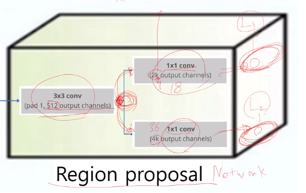
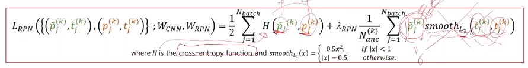
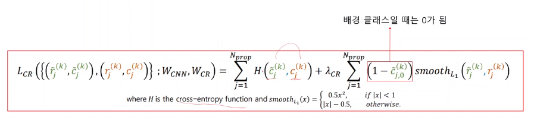

# [Week14 - Day4] Computer Vision 2 - Object Detection

## 1. 객체 인식 개요
  - 문제정의
    - 영상 안에 있는 모든 객체와 객체의 위치를 탐색
    - 가중치 업데이트
      - 현재의 예측치와 Ground Truth의 차이가 줄어들도록 CNN 업데이트
    - 객체 box가 반드시 한 개 X
      - 영상 1개에 대해 벡터 1개로는 모든 객체 표현 불가능
      - 객체별로 벡터가 필요
    - 객체의 위치 탐색 + 객체 영역의 크기 결정 + 객체의 종류 분류
  - 요소 기술
    - Region Proposal
      - 객체가 있을만한 영역을 다수 추천
    - Non-Max Suppression
      - 겹치는 영역을 제거
    - Classification
      - 영역 속의 객체를 분류
    - Bounding Box Regression
      - 객체 영역을 미세조정

## 2. Faster RCNN
  - 기본 흐름
    - Region Proposal과 기존 CNN 연산을 같이 진행
  - Base Network
  - Region Proposal Architecture
    - 
    - 3x3 conv
      - spatial size 변화 X+
    - 1x1 conv
      - 2k output channel
        - objectness 벡터
      - 4k output channel
        - bounding box 벡터
      - objectness + bounding box -> 위치에 해당하는 Feature 벡터
    - Intersection over Union (IoU) Measure
      - IoU = 교집합 / 합집합
      - 높을수록 영역 일치
    - objectness의 기준
      - Ground Truth object 영역과 IoU를 계산하여 Threshold를 넘으면 object 영역으로 판단
    - Box Boundart Regressor
      - object의 boundary box의 좌표 탐색
      - 영역간 매핑하는 함수를 학습
      - 초기에 지정한 boundary box가 객체의 실제 box와 많이 다른 경우 학습 어려워짐
        - RP는 Ground Truth object 영역과 IoU가 0.6 이상이 되는 후보 영역의 탐색이 주 목적
      - Anchor Box
        - 정해진 크기와 비율을 가진 box
    - 학습
      - 입력 : 이미지
      - Ground-Truth
        - Bounding box
        - Class
      - Predicted Proposals
        - Probability of Objectness
        - Proposals transformation
      - Ground Truth Proposals
        - Probability of Objectness
          - Anchor box와 IoU가 가장 큰 object의 bounding box의 IoU가 0.7 이상이면 1
        - Proposals transformation
      - loss 계산
        - 
  - Classification & Regressor
    - ROI Pooling
    - Non-Max Suppression
    - 학습
      - RPN에서 나온 Predicted Objectness Score
      - RPN에서 나온 Predicted Bounding Box
      - 