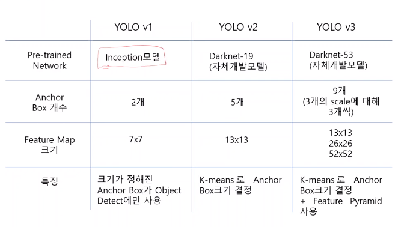

# [Week14 - Day5] Computer Vision 3 - YOLO & SSD

## 1. 객체 검출
  - 1 Stage
    - YOLO, SSD, Retina-Net
  - 2 Stage
    - Faster-RCNN, Mask-RCNN

## 2. YOLO
  - 소개
    - You Look Only Once
    - 자체 개발한 Darknet 기반 객체 탐지 알고리즘
  - 구조
    - v1
      - GoogLeNet을 일부 수정한 모델
      - (14 x 14 X 1024) Conv 층 x3
      - (7 x 7 x 1024) Conv 층 x2
      - FC Layer
  - 학습 (v1 기준)
    - 2개의 Anchor box
      - x 좌표, y 좌표, width, height, confidence
    - anchor box 1 + anchor box 2 + 20개의 클래스 -> (1, 30) 벡터
    - Ground Truth box의 중심을 포함한 셀을 Positive, 그 외의 셀을 Negative로 지정
      - Positive 셀에서 Ground Truth box와의 IoU가 큰 Anchor box만 c값을 1로 설정, 나머지는 0
    - confidence가 1인 Anchor box들만 Boundary box에 대한 회귀를 수행
      - 객체가 있는 anchor box는 confidence가 1이 되도록 학습
  - 추론
    - Non-Max Suppression
  - 버전별
    - 
    - v2 이후
      - K-means 기반 Anchor Box 크기 결정
    - v3 이후
      - Feature Pyramid
        - box의 사이즈가 같아도 feature map의 스케일에 따라 객체 탐지 여부가 달라짐
      - Feature Pyramid를 사용하여 여러 스케일에서 객체를 탐지
  - Feature Map
    - v1
      - anchor box 1 + anchor box 2 + 20개의 클래스
    - v2
      - anchor box 5개로 증가
    - v3
      - Feature Pyramid 적용으로 v2 형태의 맵이 스케일 별로 존재

## 3. Single Shot Detector (SSD)
  - 구조
    - 다양한 스케일에서 Anchor box를 통한 특징 추출
    - Non-Max Suppression으로 필터링
  - 추론
    - 여러 스케일에서 뽑아낸 Bounding Box들에 NMS 적용
    - 