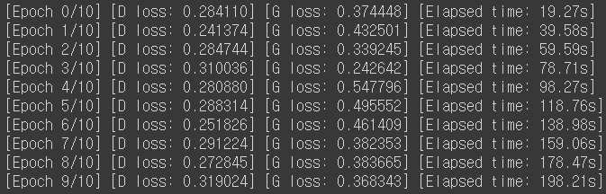
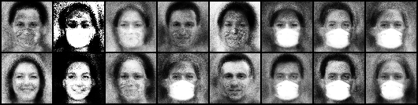
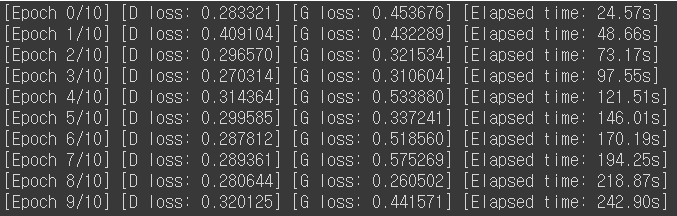
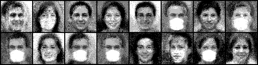
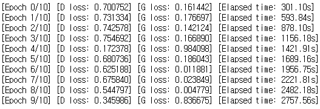
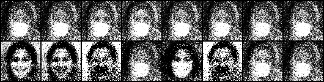

# [Week14 - Day6] Kaggle Competition Log
  - GAN을 이용한 얼굴 마스크 이미지 생성

## TIP & QnA
  - 조건이 들어간 GAN -> 조건도 벡터화하여 모델에 제공하여야 함
  - Batch Size
    - Learning Rate 보다는 덜 중요함
  - Disciminator  
    - 분류하긴 함
  - 모델 크기 제한
    - Colab에서 돌아갈 정도면 됨 -> 약 12기가
  - Augmentation
    - Mixup, Cutmix -> 일반적으로 GAN에서는 사용하지 않음
  - 생성모델과 판별모델의 성능 차이로 인한 영향
    - 한쪽이 너무 좋으면 오히려 학습이 진행되지 않음
    - 둘 사이의 균형이 중요함
    - 판별모델이 더 빨리 좋아짐
      - epoch 여러번에 1번씩 학습하는걸로 학습을 늦출 수 있음
  - 생성모델과 판별모델의 성능 차이를 판단하는 지표
    - 주로 Loss
      - loss에 변화가 없어지면 잘못되어 가는 중
    - 그러나 결국 중요한건 경험을 통한 감
    - WGAN Loss

## Log
  - 64x64 대신 128x128 로 만들어서 다운 스케일링?
  - super resolution
  - 변수명이 꼬이니까 변화가 없지 멍청아...
  - WGAN
    - 
    - 
  - WGAN + 다운 스케일링
    - 
    - 
  - WGAN + Discrimination term
    - 
    - 
  - DCGAN으로 한번 더 해보기

## 피드백
  - Data Augmentation
    - 이미지 회전 같은 경우에는 오히려 성능을 떨어뜨릴수 있음
  - 이미지 노이즈
    - FID 계산 때 노이즈가 있으면 성능이 떨어짐
  - ResNet을 얹는다면 위치?
    - DCGAN