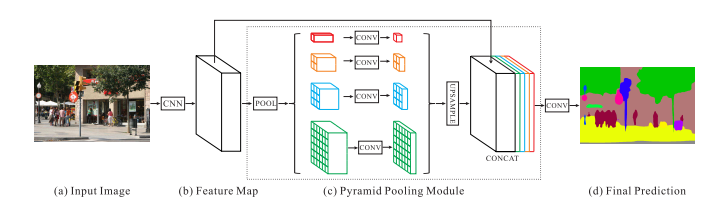
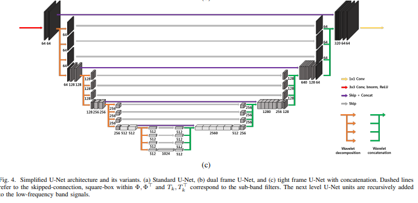

# [Week15 - Day1] Computer Vision 4 - Semantic Segmentation

## 1. Semantic Segmentation
  - Object Detection
    - 객체를 찾고 객체의 대략적인 위치를 박스로 표현
  - Sematic Segmentation
    - 클래스별로 해당 영역을 다른 클래스와 구분되도록 표현
    - Instance Segmentation
      - 객체 하나하나가 다 구분되도록 표현
  - 예시
    - https://www.youtube.com/watch?v=9e2x4dDRB-k&ab_channel=FredrikGustafsson
    - https://ai.googleblog.com/2017/10/portrait-mode-on-pixel-2-and-pixel-2-xl.html
  - Semantic Labels
    - 이미지에서 해당 영역이 어떤 클래스에 속하는지 표현
    - 클래스 별로 채널 하나를 사용
      - 한 채널에 모든 클래스도 가능은 하지만 정확성이 떨어짐

## 2. Fully Convolutional Network (FCN)
  - Conv 층을 지나면서 이미지의 크기가 작아짐
  - Upsampling으로 원래 크기로 복구
  - Interpolation (보간법)
    - Bilinear Interpolation (이중선형 보간법)
      - 1-D
        - 두 지점과의 거리에 따라 값을 결정
      - 2-D
        - 가로축 + 세로축 -> 총 네 지점의 거리에 따라 값을 결정
      - 이미지의 해상도는 유지하면서 크기만 증가
        - 이미지의 디테일한 정보 손실
  - Multi Scale Prediction
    - 보간법을 사용하는 경우 발생하는 이미지의 정보 손실을 줄이는 데에서 착안
      - 보간법을 통한 Upsampling 대신 Backward Convolution 사용
    - Backward Convolution (= Transpose Convolution, Deconvolution)
      - 출력 이미지의 크기가 입력보다 더 커지는 Convolution
    - FCN-ns
      - Pool5의 이미지를 32배 Upsampling -> FCN-32s
      - Pool5 2x upsampling + Pool4 -> FCN-16s
      - (Pool5 2x upsampling + Pool4) 2x upsampling + Pool3 -> FCN-8s

## 3. PSPNet (Pyramid Scene Parsing Network)
  - 구조
    - 
    - 이미지에서 Feature Map을 생성한후 여러 스케일로 Pooling 진행, Pooling 결과를 Upsampling 하여 최종 결과물 생성
  
## 4. Unet
  - Encoder - Decoder 구조
    - 디코딩 과정에서 인코딩 할 때의 정보를 통해 보간
  - 개선된 Unet (Tight Frame Unet)
    - 
  - 사용
    - 의학 - CT
    - 안개낀 사진에서 안개 제거
      - https://ieeexplore.ieee.org/document/8803391
    - Photorealistic Style Transfer via Wavelet Transforms
      - https://arxiv.org/abs/1903.09760

## 5. Pose Estimation, Face Estimation
  - Pose Estimation
    - 자세 측정을 통해 대상의 현재 행동을 데이터화
    - 관절의 위치가 중요
  - Face Landmark
    - 얼굴의 특징점을 탐색
    - AR
      - Face Landmark를 통해 얼굴에 사물을 덧씌우기
  - Heat Map
    - 주목하려는 부분에만 포커싱
    - Hour Glass Model (모래시계 모델)
      - Unet과 비슷한 인코더-디코더 구조
    - Stacked Hour Glass Model
      - Hour Glass Model을 적층한 다층 구조

## 6. Mask RCNN
  - Faster RCNN + FCN
    - Object Detection + Semantic Segmentation -> Instance Segmentation
  - ROI Align
    - Region Of Interest
    - 작은 이미지를 크게 키우는 과정에서 ROI의 위치가 뒤틀림 -> 큰 이미지에 맞게 ROI 재조정 필요
    