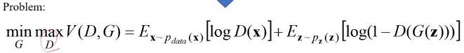
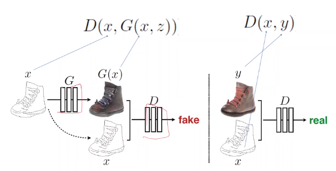
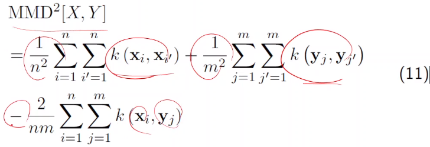
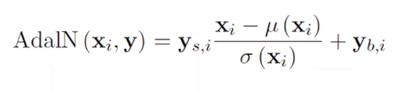

# [Week15 - Day2] Computer Vision 5 - GAN

## 1. Generative Models
  - Generative Adversarial Network (GAN)
  - Domain Adaptation
  - Style Transfer

## 2. GAN
  - Probability Density Function (PDF, 확률밀도함수)
    - 확률변수의 분포를 함수로 표현
    - 영상을 만들어내는 확률밀도함수를 알면 영상을 생성할 수 있음
      - 함수의 값이 큰 샘플을 생성
      - 문제는 영상의 PDF 계산 불가능
  - Generative Adversarial Network
    - Generator VS Disciminator
      - 생성기는 판별기를 속이기 위해 아이템을 생성
      - 판별기는 생성기가 만들어낸 아이템에 대해 위조 여부 판단
    - Generator
      - 가우시안 분포 기반의 노이즈에서 시작하여 판별기를 속이기 위한 샘플들을 생성
    - Disciminator
      - 생성기가 만들어낸 샘플들을 구분하여 가짜 샘플들에 대한 loss를 계산
    - 최적화
      - 
      - V(D,G)를 최대로 만드는 D + 최소로 만드는 G
    - Latent Space (잠재 공간, 임베딩 공간)
      - 생성기의 입력을 조금씩 바꾸면서 정확도를 높임
        - Walking in the Latent space

## 3. Pix2Pix
  - Fixed Loss 단점
    - 고정된 결과 -> 성능 저하
  - Universal Loss
    - 기존에 정의된 손실 함수 대신 진짜 샘플로부터 학습하는 손실 함수
  - PatchGAN
    - 이미지를 작게 만들어 디테일한 묘사를 숨김
      - 판별기가 디테일을 확인할 수 없어 진짜로 판단
    - 이를 해결하기 위해 판별기가 이미지의 전체를 보는 대신 일부분(Patch)만 보고 판단
  - Pix2Pix Loss
    - 생성된 샘플과 진짜 샘플의 차이를 줄임
  - 구조
    - 
    - 입력의 쌍이 맞지 않으면 거짓이 되어버림
  - 사용 예시
    - 그레이스케일 이미지를 컬러화
    - 낮 사진을 밤 사진으로 변경
    - 항공 사진 -> 지도
    - Labels to Facade
    - Edges to Photo

## 4. 그 외
  - Conditional GAN
    - 노이즈 + 조건을 입력으로 제공
  - Stack GAN
    - 텍스트를 입력받아 이미지를 생성
  - Conditional + Stack GAN
    - 텍스트를 입력받아 만든 이미지를 Conditional GAN의 노이즈로 사용
  - Progressive GAN
    - 작은 사이즈의 이미지에서 시작하여 점진적으로 크기를 늘려서 고해상도의 이미지를 생성
    - 저차원에서 시작하여 고차원의 구조를 미리 파악
  - CycleGAN
    - 쌍으로 된 데이터셋은 구하기 어려움
      - 각각의 데이터셋은 구하기 쉬움
    - G, F 2가지 모델을 사용
      - G는 기존의 생성모델 역할
      - F는 G가 생성한 샘플을 다시 원복시키는 새로운 생성모델
      - F(G(x))와 x의 차이를 줄이는 것을 목표로 설정
    - G가 생성한 샘플이 입력과 많이 차이나게 되면 F가 원복하는데 더 어려움
      - 전류가 저항이 낮은곳으로 더 많이 흐르는 것 처럼
      - 학습의 흐름이 더 쉬운쪽으로 갈 수 있도록 조절
  - CyCADA

## 5. Domain Adaptation
  - 필요성
    - 데이터셋의 제작
      - 비용이 너무 큼
      - 대기업이 아니면 시도하기 힘듬
  - Train on Source, Test on Target
    - 레이블이 불충분하거나 존재하지 않는 목표 도메인에서 효과적으로 추론하는 모델을 학습하기 위해 레이블이 풍부하고 목표 도메인과 관련이 있는 소스 도메인을 이용하는 방법론

## 6. Style Transfer
  - 이미지에 다른 이미지의 스타일을 입혀서 새로운 이미지를 생성
  - Style의 정의
    - 채널과 활성화 사이의 상관관계
  - Demystifying Neural Style Transfer
    - Feture mean difference
      - 평균은 같고, 분산만 다른 2개의 가우시안 분포
        - RV의 속성 평균 차이에 주목
        - 가우시안의 경우 $ \varphi (x) = x^{2} $ 형태의 2차 특징
      - 가우시안 - 라플라스
        - 평균과 분산이 동일
        - 고차원 속성을 사용한 평균의 차이
    - Maximum Mean Discrepancy (MMD)
      - 
  - Adaptive Instance Normalization
    - 
  - StyleGAN
    - Style transfer 개념을 적용하여 generator architetcture를 재구성
    - 인물 얼굴 생성기
      - Coarse, Middle, Fine