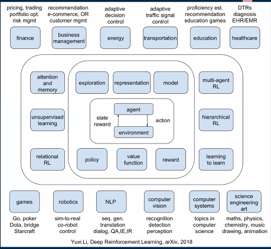

# [Week15 - Day5] Career Talk
  - 한기용 멘토님
  - 김찬란 멘토님

## 1부 - 한기용 멘토님
  - 시작하기 전에
    - 변화를 두려워 하지마라!

### 1-1 데이터 직군
  - Data Scientist vs ML Engineer
    - Feature Engineering
    - 추천, 검색
    - Operation
  - Data Analyst
    - 마케팅, 제품 분석
    - A/B 테스트 분석
  - Data Engineer
    - 데이터 웨어하우스 & ETL
    - Feature Computation & Data Scientist Support
  - ML Ops
    - ML 모델 개발, 런칭에 관련된 연속적인 모든 것
    - DevOps + ML
      - DevOps
        - 개발자가 만든 코드를 시스템에 반영하는 프로세스
        - 시스템이 제대로 동작하는지 모니터링, 이슈 감지시 Escalation
      - MLOps
        - ML 모델을 시스템에 반영하는 프로세스
        - ML 모델의 개발을 더 쉽게 하고 자동화하여 자주 모델 빌딩, 이를 프로덕션으로 런칭
        - 모델 서빙 환경에 문제가 생기거나 모델의 성능이 떨어질 경우 감지하고 조치
  - 당근마켓 기준
    - 데이터 엔지니어
    - 머신러닝 모델 개발자
    - 머신러닝 개발자
      - 사용자 이해
      - 컨텐츠 이해
      - 개인화 추천
    - 머신러닝 서비스 개발자
    - 머신러닝 시스템 개발자
  - 신입이라고 신입채용만 찾지 말고 경력 채용에도 찔러넣기
    - 개인 프로젝트, 교육 이수 내용이라도 집어넣고 지원하면 결국 판단은 인사팀에서 해줌

### 1-2 면접
  - 신입과 경력의 차이
    - 인턴 전환
    - 면접에서 하는 질문과 눈여겨 보는 부분
      - 발전 가능성 등
    - 레퍼런스 체크
  - 내부 직무 전환
    - 한 직군에서 시작하여 경험을 쌓고 다른 직군으로 직무 전환
  - 프로세스
    - 채용 공고
    - 이력서 스크린
      - 커버 레터
      - 관계없는 과거 경력?
    - 전화 인터뷰
    - 온사이트 인터뷰
    - 레퍼런스 체크 (배경지식 체크)
    - 오퍼
    - 연봉 협상
  - 면접이 끝난후
    - 질문 복기
  
### 1-3 행동양식
  - 질문
    - 협업
      - 팀프로젝트 협업 경험
      - 갈등, 해결 (그만 좀...)
    - Ownership
      - 프로젝트 진행 중 발생한 문제와 해결
    - Impact
      - 경험중 임팩트가 가장 큰것
    - Craftsmanship
      - 내 일이 아니지만 해결하려고 했던 경험
  - 답변
    - 상황 / 업무 / 액션 / 결과

### 1-4 질문
  - 다양한 질문
    - 이력서 내용에 관해 끝없는 꼬리 물기
      - 프로젝트
        - 어떤거 했어요?
        - 왜 했어요?
        - 왜 그렇게 했어요?
        - 이거는 왜 안해봤어요?
        - 이런 내용은 찾아봤어요?
        - 또 하면 어떨거 같아요?
        - 왜 또 하고 싶어요?
        - <del> 머...멈춰...! <del>
    - 과제를 주고 리뷰
  - 좋은 질문은 면접관의 생각을 바꾼다
    - 회사가 무엇을 하는지 미리 검색
    - 면접관의 소개를 듣고 관련 질문도 좋음
    - 내가 하면 좋은 질문
      - 최초 입사시 하는 일?
      - 회사에서 사용하는 기술 스택?

### 1-5 신입의 전략
  - 취직 준비
    - 가능한 모든곳에 이력서 투척하고 면접 싹다 하기
      - 정말 하고 싶은 곳은 나중에 면접보기
    - 100개 던져서 1개만 성공하면 됨
    - 어디서든지 시작해서 발전하기
      - 남과 비교 X
      - 시작은 미약하지만 그 끝은 창대하리라
      - 회사의 이름보다는 같이 일하는 사람들이 더 중요
      - 빨리 시작해서 필요한것을 배워가기+
  - 직장 선택
    - 성장성
      - 회사의 크기가 아닌 남은 성장 가능성
    - 사람 / 문화 
      - 회사 내 inner circle
        - 회사에 들어가도 서클에 끼지 못하면 인정받지 못함
        - 서클의 존재 파악도 어려움
    - 매니저
      - 보고 배울점이 많은가?
  - The First 90 Days
    - 자기 검열 X
    - 매니저 스타일 파악, 피드백 요청
    - 과거 상처 버리기
    - 열심히 그러나 서둘러서는 안됨
    - 남과 비교 X
    - 작은 성공도 결국 성공이니 하나씩 이끌어내기
  - 기술의 습득 X, 결과에 집중
    - 담당 업무를 잘하기 위한 기술 습득
    - 담당 업무의 성공/실패를 어떻게 결정할지
      - 매니저와 소통
      - 성공 지표에 대해서 생각
    - 그냥 일을 하지말고 필요한 이유를 생각
  - 피드백
    - 스킬셋 피드백
      - 코드 리뷰
      - 유닛 테스트
    - 행동양식
      - Comfort Zone과 연결되면 어려움
      - 레벨이 오를수록 중요해짐

### 1-6 QnA
  - 스타트업도 많이 경험하셨는데, 스타트업에서는 어떠한 역량이 중요한지도 정말 궁금합니다. -> 스타트업 특성상 인원이 부족한 경우가 많은데, 어떠한 식으로 일처리를 진행하고, 발전해나가는지, 그리고 어떠한 식으로 회사가 커나가는지도 궁금합니다.
    - 투정 안부리는 사람
    - 왠만하면 다 필요함
    - 사람이 굉장히 자주 바뀌고 변화가 심함
  - 채용자 관점에서 대외활동을 비중있게 보나요?? 개인 프로젝트 경험과 대외활동 중 더 비중있게 보는 부분은 어느 것 인가요?
    - 레벨에 따라
    - 신입, 경력이 적으면 개인프로젝트 중요
    - 매니저 등이면 대외활동에 따라 추가적인 인적 연결이 생겨남
  - 채용으로 뽑을때 이 사람이다 싶은 큰 요소가 있을까요? (ex: 케클 순위/긱허브/대학원/자격증 등등)
    - 캐글 레벨이 오르면 직업 구하긴 쉬움
    - 결국은 면접, 평판
  - 데이터 엔지니어나 데이터 관련 직무에서 어학점수나 자격증이 큰 영향을 미칠까요? (ex. 최소한의 어학점수 기준이나 정처기, sqld, sqlp, 빅분기 등의 자격증들)
    - 자격증은 별 영향 없을 듯
    - 해외는 어학점수가 아니라 어학능력이 필요
  - ml을 공부하면서 더욱 데이터 엔지니어에 대해 관심을 가지게 되었는데 데이터 엔지니어의 간략적인 커리큐럼이 어떻게 될까요?
    - Python, SQL, Airflow
    - 엔지니어 -> 과학자, Ops 등등
  - 취업 준비를 하는 입장에서 데이터 엔지니어로 방향성을 잡고 공부를 할때, 대용량 데이터를 처리해볼 경험을 가지지가 쉽지 않은데, 공부 방향성이나 방법에 대해서 추천해주실 수 있으실까요?
    - 이 과정 이만큼 하고 다른 과정을 또 배우는건 고민이 필요함
  - 공백이 2년 정도 되는데 취업에 큰 문제가 될까요?
    - 이거 걱정할 시간에 이력서나 쓰세요

## 2부 - 김찬란 멘토님
  - 커리어 토크

### 2-1 실무 필요 역량
  - 핵심
    - 논문 구현 기술
    - PyTorch - TensorFlow
    - 최신 기술의 빠른 조사 및 적용
  - 논문 구현
    - Docs를 볼줄 알아야 함
      - Class - Parameter, Attribute
      - Deprecated 주의
    - Baseline 찾기
      - torchvision.model
      - torch.hub
      - PyTorch ImageModels
      - Paperswithcode
      - Kaggle
    - 라이선스
      - GNU GPL
      - MIT
    - 구현
      - 구현해보고 정답과 비교하기
        - 처음하면 코드가 있는걸로 시도
          - 비교 내용 : 학습 결과, 구현 스킬
        - 논문 실험결과와 비교
      - 빡머가리라서 못 만들겟어요...
        - 구현된 코드를 내 방식으로 변경하기
    - 같은 모델은 같은 성능이 나오는가
  - PyTorch - TensorFlow
    - 왜 필요한가 -> 시간 단축
    - 연구는 PyTorch 선호
    - TPU 사용시 TensorFlow 전용
    - Python 은 서버에서 오버헤드가 큼
    - https://github.com/tango4j/tensorflow-vs-pytorch
  - 최신 기술 조사
    - Papers with Code
      - 인생에는 꼼수가 필요
      - 데이터셋, 모델들이 다 정리 되어 있음
    - Kaggle
      - 데이터셋도 주고
      - 노트북 환경도 주고
      - 모델 예시도 있고
      - SIIM-FISABIO-RSNA Covid-19 Detection 기준
        - X-ray 사진으로 코로나 찾기 (Object Detection)
        - 데이터셋 다 제공
        - Code 누르면 다른 유저들의 코드를 제공
    - 학회, 논문
      - 쓸데없는 건 알아서 걸러내기
      - 논문
        - 컨퍼런스 (학회)
          - 발표회가 열리고 사람들이 발표
          - 주기가 짧음
          - 분량도 적음
          - CVPR, ICCV/ECCV, SIGGRAPH, NIPS, ICML, AAAL, ACL 등등
        - 저널
          - 책으로 출간
          - 분량이 많음
          - 검토에도 오래걸림
        - 컴퓨터 분야는 컨퍼런스가 비중이 높음
          - 발전속도가 빠르기 때문
        - 그 외
          - arxiv
            - 컨퍼런스 사이에 빨리 발표가 필요할때
            - 신뢰도가 들쭉날쭉
      - 행사
        - if kakao
        - 네이버 데뷰
        - NVIDIA GTC
        - 취직하면 회사 빼먹고 가기 좋음<del>(꿀....팁....?)</del>
        - 가면 회사 굿즈도 많이 줌
      - 커뮤니티
        - TensorFlow Korea 페이스북 페이지

### 2-2 포장은 나쁜게 아니다
  - 내용이 적으면 포장을 해야지 들어가서 시작을 할수 있고 적을 내용이 많아짐
  - 들어가기 전
    - 나의 경험, 나의 방법
      - 예제 코드를 다른 데이터에 적용
        - 그냥 모델 갖다 썼습니다 X
        - 다른 데이터에 적용할 수 있게 바꿔봤습니다 O
        - 근데 개선이 됐다? Perfect.
      - 지원하려는 곳에 유사한 컨셉으로 수정
        - 뭘 바꿀지 모르겠다 -> 다 때려박고 진행
        - 이후에 하나씩 빼면서 영양가 있는거만 남기기
          - 성능향상의 요인이었어요 어필 가능
      - 무난한 성공보단 역경으로 인한 실패
      - 초록회사 실제 질문
        - 1. GAN 활용 프로젝트 해봤다고 했는데 Mode Collapse가 뭔지 설명하고 해결하는 방법?
          - 관련 기술에 대한 용어들은 모두 공부를 하고 갈것
        - 2. A 방법이 최선이었나? 다른 기술은 없었나? 걔네들 다 비교해서 고른건가? 안했어요? 왜 안해봤어요?
          - 예상을 하고 갈것 -> 이런 질문은 대개 관련 경험자들이 하기 때문에 더 좋은 방법일 확률이 높음
          - 예상대로 나오면 나이스, 안나오면 도박임
  - 들어가서
    - 회사의 실적, 방법
    - 회사에서 어떤 일을 할지?
    - 회사에서 어떻게 일을 할지?
  - 입사를 하고나서 겸손해져도 된다
  - 과대 포장은 안좋음
    - 안 한걸 했다 X
    - 못하는걸 할 수 있다 X
    - 면접하면서 다 들키게 되어있다
  - 스토리텔링을 통해 가치를 증대
    - 현재의 결과가 하늘에서 떨어진게 아닌 시작부터 차근차근 나가는 소토리
    - 진행하면서 만난 역경과 해결 경험, 실패 경험 이런걸 포장을 잘하는게 실력
  - 해봤는데 잘 안되더라구요
    - 면접 탈락의 지름길
  
### 2-3 관련기업과 세부직군
  - 머신러닝 전문 기업
    - 업스테이지AI, 마인즈랩, 스캐터랩
    - bepro
    - oddconcepts
    - 의료 3대장 : Lunit, Vuno, JLK
    - sendbird 등
    - 대부분 한창 성장중인 스타트업
  - 기업에서 쓰는 머신러닝
    - 삼성전자, 삼성 리서치
    - LG전자 CNS, CTO
    - 네이버 클로바, 랩스, 라인
    - 카카오 AI, 뱅크, 엔터프라이즈, 엔터테인먼트
    - 대기업 -> 사업수단으로 사용 -> BM이 사라지면 같이 안녕~ -> 지속적인 성과가 필요
  - B2B - B2C - 연구팀
    - 재미 -> B2C
    - 솔루션 -> B2B
    - 연구 -> 연구팀 -> 기간 제한 없고, 비즈니스 모델 만들 필요 없고, 지속적인 성과 필요없고 -> 성과가 없을 수도 있음;
  - 상상도 못한 회사 (ㄴㅇㄱ)
    - 이마트
    - LG 화학
    - 아모레퍼시픽
    - 등등
  - 세부직군
    - 데이터 분석가
    - 데이터 과학자
    - 데이터 엔지니어
    - ML 엔지니어
    - 다 비슷한 내용이라 정답이 없음
    - 
  - 유사직군
    - Product Analyst
    - Business Analyst
    - Performence Marketer
    - CRM

### 2-4 좋은 회사 고르는법
  - 회사 정보 보는 법 (직무, 구성원, 복지)
    - 직무 설명은 자세한걸로
    - 구성원을 설명하는 곳
      - 모든 구성원을 표시 -> 한명 한명이 중요하다라는 어필
    - 복지
      - 연차의 자유
      - 출퇴근제도
      - 보험
      - 복지 포인트
      - 명절 선물
      - 교통비
      - 경조사
      - 보육
      - 대출
      - 기타 등등
  - 잡플래닛, 블라인드
    - 내부인이 말하는 리뷰 -> 신뢰도 높음
  - 선발대(선배, 친구, 동료) 찾기
  - 결국은 팀 by 팀, 사람 by 사람
    - N사 - 출퇴근 눈치 줌, 정시퇴근 직전에 일터져서 잔업
  - 이직보단 부서 이동이 쉽다
### 2-5 후배들에게
  - 초봉의 중요성
    - 개발자와 데이터 과학자/ML/AI 구분 (AI 석사 출신 개발직군으로 퉁쳐서 3800? 선넘네?)
      - 직무의 구분이 없을 수 있다 -> ML로 갔는데 일반개발자 업무하면 경력에 도움이 안됨
      - 이러면 이직이 어려움
    - 봉급은 사람을 얼마나 중요하게 생각하는지에 대한 증거
      - 직원을 중요하게 여기지 않으면 사소한일부터 큰일까지 다양한 문제 발생
    - 연봉 협상은 절대수치가 아닌 % 수치
    - 이직을 해도 직전 연봉의 %로 인상
  - 커뮤니티 활동
    - 많은 회사와 팀들의 직무에 대한 정보를 얻을 기회
    - 추천 입사의 중요성
    - 입사를 넘어서 이직도 생각할것
    - 지속적인 배움의 기회
    - 새로운 분야에 대한 접근 기회
  - 공모전, 경진대회
    - 요즘 유행
    - 하지만 아직은 실무보다 낮은 것으로 인식이 좋지 않음
      - 실무랑 크게 다르지 않다는 것, 문제의 난이도가 높다는 것을 주로 어필
      - 꼰대들이라 Kaggle이 뭔지도 모를 확률 높음
  - 불합격
    - 서류 탈락
      - 스펙이 ㅈㄴ 좋은데 서류컷
      - 너무 평범한 이력서, 극복 불가능한 단점
      - 포장을 잘해야됨
    - 코딩 테스트 탈락
      - 코테 공부가 답임
      - 프로그래머스 앞광고인가?
    - 기술 면접 탈락
      - 관련 기술의 공부가 더 필요함
    - 임원 면접 탈락
      - 님 인성 개 빻았네요 X
      - 회사의 인재상과 맞지 않는 사람인것 -> 통과해도 회사와 안 맞을 확률 높음

### 2-6 기본 역량
  - 코테, 기술
  - 해당 직무 역량 이해
  - 회복 탄력성
    - 번아웃이 왔을때 회복할 방법 필요

## 3부 - 김찬란 멘토님
  - 커리어 고민 + QnA

## 3-1 커리어 고민
  - 보완이 필요하다고 생각하는 부분
    - 객체지향
      - 디자인 패턴 공부
    - MLOps
      - 장비가 없으면 할 수 없는 부분이 있음
    - 작동 원리를 모른채 사용, 활성화 함수나 정규화가 수학식인건 알지만 특징과 효과를 모름, 코드도 모르겠음
      - 포트폴리오에 작성할 내용은 알아둬야 함
      - 정 모르겠으면 멘토님들한테 물어보고 그대로 복사하여 사용
    - 플랫폼별 기초 지식
      - 기업 행사들을 자주 다니면서 조사
    - CS 지식
      - 코테 공부가 1등, 포트폴리오가 2등, 기초 개념 지식을 3등으로
      - 하지만 같이 공부하여 해당 부분 감점을 적게 받으면 좋음
    - CV 외에 NLP, 추천, GAN
      - 포폴에 다 넣어서 방해가 되는 경우도 있음
    - 도커
      - 필수죠
    - 선형대수
      - 공부는 해야하는데 질문은 없음
      - 머신러닝의 기초 원리는 알아야 함
    - 통계
      - 통계도 역시 알아야함, 계산을 물어보진 않음
      - 인과관계와 상관관계 질문 거의 무조건
      - A/B 테스트도 거의 무조건
    - 기술에 대한 숙련도
      - 숙련도의 기준은 결국 면접
      - 해당 부분에서 떨어지면 거기 숙련도가 부족한것
    - 벡엔드와 분석/모델링 경험 부족
      - 지속적인 질문
  - 커리어 고민
    - 나이가 많아서 늦는거 같아요
      - 나이가 많은데 어린애들보다 돈 적게 받을 자신 있어요?
      - 기존에 배우던것과 AI/ML을 접목할 수 있는 분야도 얼마든지 있을것
      - 예전에 배운것을 무시하고 버릴 이유가 없음, 언제 다시 쓰일지 모름
    - AI를 배워보니 AI는 내 길이 아닌거 같아요
      - 공부의 재미와 업무의 재미는 또 다를 수 있음
    - 수상 이력은 충분하다고 생각하는데 코테를 못쳐요
      - 코테 공부 하세요
      - 코테 떨어지면 결국 아무것도 못함
    - 포트폴리오 준비 방법
      - 남의 포폴보고 잘 배끼세요
      - 남의 걸 보고 내가 부족하다고 생각하는 부분을 더 채울것
    - 학교 졸업하고 1년 반 지났는데 한게 없어요
      - 한게 없으면 말이 안된다
      - 뭐가 됐든 한게 있으니 그걸 예쁜 포장지로 감싸야 함
    - 실력이 같으면 나이가 많은데 전공자도 아닌 사람을 뽑느니 어리고 전공자인 사람을 뽑지 너를 왜 뽑냐?
      - KDT는 충분히 고급과정 (솔까 깊이로 따지면 전공과정보다 ㅈㄴ 깊음)
      - 대부분의 웹개발 과정은 질이 안좋은 경우가 많음
      - 눈을 낮추고 범위를 넓게 잡으면 충분히 가능할 것
      - 나이가 많다면 인사팀이나 매니저 관련 업무를 추천, 프리랜서 등도 충분히 가능성 있음
    - 모델 추론 시간 단축
      - Python 출발 -> C++로 전환
      - 모델 자체 최적화 (가지치기)
    - 다 경력만 찾으면 신입은 어디서 경력을 쌓나요
      - 중소기업인데 경력 5년? 절대 충원 안됨
      - 신입으로 그냥 넣기

### 3-2 QnA
  - MLOps
    - DevOps의 하위 분류
    - 개발자가 많이 일하면 DevOps 업무는 줄어듬
  - 찬란님 게임 업계에서 종사 중이시라고 하셨는데 어떤 직무 수행 중이신지 여쭤봐도 될까요..?
    - 기밀임
    - 생성 모델 관련
  - 블라인드나 잡플레닛에서 보통 몇점 정도의 평점이 괜찮은 회사일까요...ㅎㅎ
    - 4.0 이상
  - 머신러닝, 딥러닝을 이해하는 백엔드, 프론트엔드 혹은 풀스택 개발자로의 방향성은 어떻게 생각하시나요
    - 프로토타입 개발 직군도 증가중
  - 시간이 많지 않다면 취업을 위해서 프로젝트를 더 많이 경험해 보는 것이 좋을까요, 아니면 프로젝트의 갯수는 적어도 cs지식과 코테를 준비하는게 좋을까요??
    - 1. 코테 2. 프로젝트 3. CS
  - 자신이 주니어 Engineer, Analyst로 초봉을 얼마 정도 받을 수 있는지, (물론 기업 바이 기업이겠지만), 알고 계신 지표, 기준이 있을까요??
    - 일반적인 중소기업은 적음
    - 신생 스타트업은 오히려 지원을 많이 받아서 높음
      - 신입 기준 약 4000
  - 모델의 원리, 장점을 모른채로 가져다 적용만 하고 성능이 잘나온걸 쓸줄 안다고 할수 있을까요?
    - 성능이 잘 나온것에 집중하여 포폴 작성
      - 모델의 서비스화에 유리하고 프로토타입의 빠른 개발에 장점이 있다는 것을 어필
    - 면접에서 질문이 나올거 같다면 해당 모델의 장점을 그냥 암기
  - N- 다니는 분들 N- 게임 많이 하시나요?
    - 많이 함, 티는 안냄