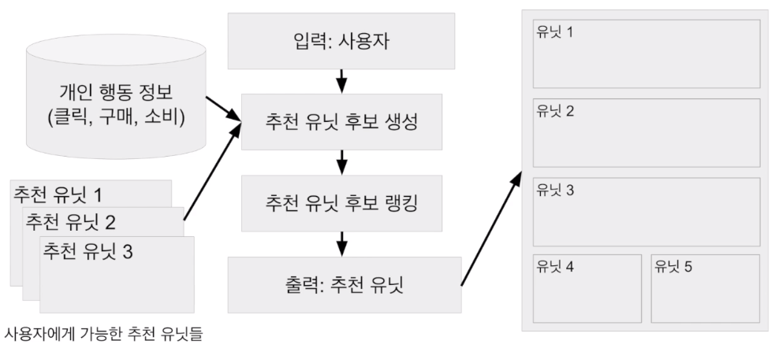
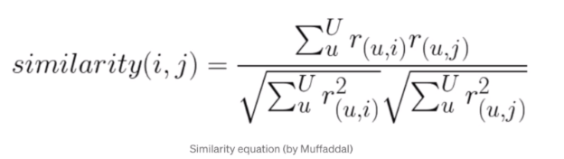

# [Week16 - Day3] Recommendation System 4 - 협업 필터링

## 1. 추천 엔진
  - 기본 구조
    - 
    - 추천 유닛 레벨
      - 입력 : 유저, 아이템
      - 추천 후보 생성 <- 개인 선호도 + 아이템 정보 추가
      - 추천 후보 랭킹/필터링
      - 출력 : 추천 아이템

## 2. 협업 필터링
  - 다른 유저들의 정보를 이용하여 내 취향을 예측
    - 크게 3 종류
      - 유저 기반 (User to User)
        - 나와 비슷한 평점 패턴을 보이는 다른 유저들을 찾아서 높게 평가한 아이템 추천
        - " 나와 비슷한 사용자들이 좋아요를 누른 영상"
      - 아이템 기반 (Item to Item)
        - 평점 패턴이 비슷한 아이템을 찾아서 추천
        - "이 영상을 본 다른 사람들이 좋아요를 누른 영상"
      - 예측 모델 기반
        - 평점을 예측하는 머신러닝 모델 생성
        - 유저, 아이템 기반 -> 유사도를 기반으로 추천 아이템 결정
  - 구현
    - 크게 2 종류
      - 메모리 기반
        - 코사인 유사도, 피어슨 상관계수 등을 사용해 비슷한 유저, 아이템을 탐색
        - 평점 예측 시 가중치를 사용한 평균 사용
        - 이해 쉬움, 스케일을 크게 하기 어려움
      - 모델 기반
        - 머신 러닝을 사용해 평점을 예측 (PCA, SVD, Matrix Factorization, 딥러닝)
          - 오토인코더를 통한 차원 축소
        - 벡터 차원 축소를 통해 평점 데이터 부족 문제를 해결
        - 동작원리의 이해가 어려움
      - 메모리 기반 vs 모델 기반
        - 메모리 기반 : 유사도 함수 기반 유사 유저, 아이템 검색
          - KNN 역시 여기에 속함
          - 평점 예측 X
        - 모델 기반 : 비용함수 기반으로 학습
          - 머신 러닝
            - 넷플릭스 프라이즈 -> RMSE를 평가 지표로 사용
          - SVD++ : SGD 사용한 학습
          - 딥러닝 : 오토인코더를 사용하여 유저 아이템 행렬의 패턴 학습
            - 오토인코더 : 딥러닝에서 데이터 차원을 축소하는 방식으로 인코딩을 통해 데이터 압축, 디코딩하여 데이터 복구. 인코딩이 차원 축소 담당
  - 평가
    - 메모리 기반
      - 유사도 기반 -> 평점 예측 X -> RMSE 사용 불가
      - Top-N, nDCG를 사용
        - 유저가 좋아한 아이템을 일부 남겨두어 추천 리스트에 포함되는지를 판단
        - 순서까지 고려하면 nDCG (normalized Discounted Cumulative Gain)
    - 모델 기반
      - 머신러닝 알고리즘에서 사용하는 일반적인 방식 (RMSE 등)
      - Top-N, nDCG 사용 가능
    - 온라인 테스트 (A/B 테스트)
      - 가장 좋은 방법은 역시 실제 유저에게 적용하여 성능을 평가
  - SurpriseLib
    - 협업 필터링 관련 다양한 기능 제공
      - KNNBasic 이용 -> 유저 기반, 아이템 기반 협업 필터링 구현
      - SVD or SVDpp 이용 -> 모델 기반 협업 필터링 구현
    - 알고리즘 성능 평가를 위한 방법 제공

## 3. 유저 기반 협업 필터링
  - 유저의 유사도 측정
    - 유저들의 아이템에 대한 평점을 벡터로 표현
    - 지정된 유저와 다른 유저들의 유사도 측정
      - 유저-아이템 행렬을 유저간 유사도 행렬로 변환
      - 유사도가 가장 높은 상위 N명 선택
      - N명의 유저들을 대상으로 지정된 유저가 평가하지 않은 아이템을 평가
    
## 4. 아이템 기반 협업 필터링
  - 아이템의 유사도 측정
    - 주어진 아이템을 기반으로 가장 비슷한 아이템을 찾아서 추천
      - 