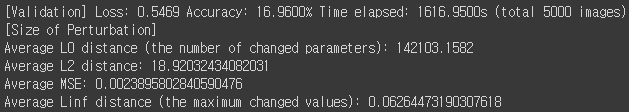

# [Week16 - Day6] Monthly Log

## black-box attack
  - 단순 노이즈 대신 아무관계 없는 이미지를 기반으로 노이즈를 생성
  - MI-FGSM
  - 모델 3개에 앙상블 기법을 적용한 CustomModel
    - 모델 및 단독 사용 정확도
      - ResNet50: 76.06%
      - VGG19: 43.00%
      - DenseNet 201: 68.46%
  - 결과
    - 