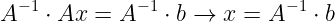
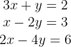

# [2주차 - Day1] 1강 선형시스템

## 1. 선형대수의 목표
  - 선형 시스템 문제를 정형적인 방법으로 표현, 해결
    + 
    + 
---

## 2. 선형시스템의 구성요소
  - 선형방정식(Linear Equations)
    + M x N Linear system
      - 3 X 2 Linear System
      - 

## 3. 선형시스템의 표현
  - 선형시스템의 대수적 표현
  