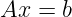
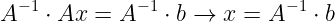
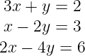
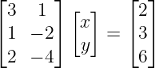

# [2주차 - Day1] 1강 선형시스템

## 1. 선형대수의 목표
  - 선형 시스템 문제를 정형적인 방법으로 표현, 해결
    + 
    + 
---

## 2. 선형시스템의 구성요소
  - 선형방정식(Linear Equations)
    + M x N Linear system
      - 3 X 2 Linear System  
      

## 3. 선형시스템의 대수적 표현
  - Ax = b로 표현     
    1. 미지수를 모아서 열벡터 x로 표현
    2. 계수를 모아 행벡터 A로 표현
    3. 상수를 모아 열벡터 b로 표현

    - ex) 3 X 2 Linear  
      
  
  - M x N 선형시스템 정리
    - Linear Equation <-> Row
    - A는 M x N 행렬
    - b는 M x 1 벡터
    - x는 N x 1 벡터
