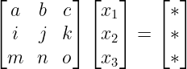
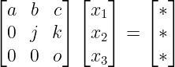
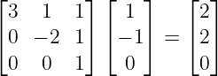

# [2주차 - Day1] 2강 가우스 소거법

## 1. 선형시스템의 해
  - ax = b 문제
    - 해가 하나인 경우(Unique solution) ex) 3x = 6
    - 해가 없는 경우(No Solution) ex) 0x = 6
    - 해가 여러개인 경우(Infinitely many solution) ex) 0x = 0
    - a = 0인 경우
      - a의 역수 X -> a가 특이하다(singular)
    - consistent, inconsistent
      - 해가 있으면 consistent
      - 해가 없으면 inconsistent

  - Ax = b (선형시스템) 에도 동일하게 적용
    - A의 역행렬 X -> A가 특이하다(singular)
    - 해가 있으면 consistent
    - 해가 없으면 inconsistent

## 2. 가우스 소거법(Gauss elimination)
  - 임의의 M x N 선형시스템의 해를 구하는 가장 대표적인 방법

  - 수행 단계
    1. 전방 소거법(Forward elimination)
        - 주어진 선형시스템을 아래로 갈수록 더 단순한 형태의 선형방정식으로 변형
    2. 후방 대입법(back-substitution)
        - 아래에서 위로 미지수에 실제값을 대입

  - EX)
    1. 전방 소거법  
       -> 
    2. 후방 대입법
      

  - 소거법에 쓰이는 기본 행연산(Elementry Row Operations)
    - 치환(Replacement)
    - 교환(Interchange)
    - 스케일링(Scaling)

  - 전방 소거법의 가치
    - 선형시스템을 가장 풀기 쉬운 형태로 변형
      - 기본 행연산을 활용하여 주어진 선형시스템 Ax = b에서 A를 상삼각 형태(upper triangular form)으로 변형
    - 선형시스템의 랭크 표시
    - 해의 유무 표시