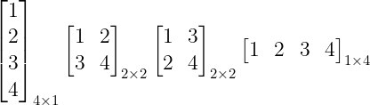
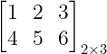
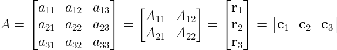
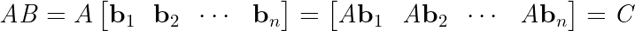
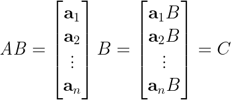
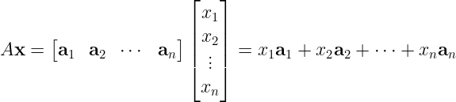
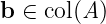
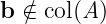

# [2주차 - Day2] 4강 행렬연산과 선형조합

## 1. 행렬 표기법과 관련 용어
  - 행렬 : 직사각형 구조에 숫자들을 담아놓은 구조
    - 요소 : 행렬의 각 숫자들
    - 특별한 행렬
      - 행벡터 - 1 X N 행렬
      - 열벡터 - M X 1 행렬
      - 1 x 1 행렬 -> 스칼라와 동일

  - 표기법
    - 요소 : A(i,j) -> a_{ij}
    - 간단히 표기 -> A = [a_{ij}]
    - 크기를 같이 표기 -> A = [a_{ij}]_{m x n}

  - 전치행렬(Transpose Matrix)
    - A가 (m x n) 행렬일 때 AT
    - A의 행 -> A^T 열, A의 열 -> A^T 행
    - (n x m) 행렬
    - a_{ij} = a^T_{ji}

  - 벡터 표기법
    - 볼드체 소문자로 표기
    - 벡터는 일반적으로 열벡터(column vector)
    - n-vector는 n개의 스칼라로 구성된 벡터
  
  - 영행렬(Zero matrix)
    - 모든 요소가 0인 행렬
    - 표기 : ***O***
    - 행렬 합에 대한 항등원

  - 정방행렬(Square Matrix)
    - 행과 열의 개수가 n개인 정사각형의 행렬

  - 항등행렬(Identity Matrix)
    - 주대각선이 1이고 나머지는 모두 0인 n차 정방행렬
    - 행렬곱에 대한 항등원

  - 행렬의 곱
    - (m x r) 행렬 A, (r x n) 행렬 B
    - AB = C=[c_{ij}], C는 (m x n) 행렬
    - c_{ij} = a_{i1}b_{1j} + ... + a_{ir}b_{rj}
      - C의 각 요소는 A의 i번째 행벡터와 B의 j번째 열벡터의 내적
      - AB != BA
    - 병렬처리로 가속
---
## 2. 스칼라, 벡터, 행렬, 텐서
  - 계층적 구조
    - 스칼라 -> 벡터 -> 행렬
      - 7 -> [7] -> [7]_{1x1}
    - 벡터 -> 행렬
      - [1 2 3 4] ->  
      
    - 행렬 -> 벡터
      - 
      - [1 2 3 4 5 6] or [1 4 2 5 3 6]
    - 텐서
      - 스칼라, 벡터, 행렬을 아우르는 개념
      - 요소가 늘어서는 방향의 개수(차원)에 따라 k-Tensor
        - 0-Tensor = Scala
        - 1-Tensor = Vector
        - 2-Tensor = Matrix
        - EX) 3-Tensor : RGB 영상 -> 3-Vector, RGBA 영상 -> 4-Vector

## 3. 분할행렬(Partitioned Matrix)
  - 행렬을 조각단위로 분할 -> 부분행렬로 이루어진 직사각형 구조로 확장 가능
  
  - 블록행렬(Block Matrix)라고도 함
  - 행렬의 곱
    - matrix-column vector products
    
    - row vector-matrix products
    

## 4. 선형조합(Linear Combination)
  - 벡터들에 대한 가중치 합
  - *A***x** = *A*의 열벡터에 대한 선형조합
  - 행렬의 구조
    - 열벡터의 리스트
    - (m x n) 행렬 -> m-vector가 n개로 된 리스트
  - 행렬 @ 벡터 연산의 구조
    - *A***x** = *A*가 가진 열벡터의 선형조합
    
  
  - *A***x** = **b**
    -  행렬 *A*의 열벡터를 가중치 합으로 선형조합할 때 **b**를 만들 수 있는 가중치 조합이 존재한다면 해당 선형시스템의 해가 존재, 해는 가중치 *x**i* 들로 구성된 **x**

  - 열공간(Column Space)
    - *A*의 열벡터들에 대한 가능한 모든 선형조합의 결과를 모은 집합
    - col(*A*)
    - consistent, inconsistent
      - consistent  
      
      - inconsistent  
        
    - EX 1) *A*의 col(*A*)가 3차원 공간  
      - 어떤 3-Vector **b**를 이용해 *A***x** = **b**를 구성해도 선형시스템의 해가 존재
    - EX 1) *A*의 col(*A*)가 xy-평면  
      - xy-평면 상의 3-Vector **b** -> 해 존재  
      - xy-평면을 벗어난 3-Vector **b** -> 해 존재 X  
      
      