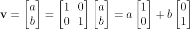
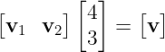
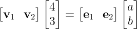

# [2주차 - Day2] 5강 좌표계 변환

## 1. 좌표계::좌표값 = 행렬::벡터
  - 벡터의 표현
    - 물리적 표현 (좌표계 X)
      - **v**의 크기 : 화살표의 길이
      - **v**의 방향 : 화살표의 방향
    - 수학적 표현 (좌표계 O)
      - 좌표계를 도입하여 시작점을 원점, 끝점을 **v**의 수학적 표현으로 정의
      - **v**의 크기 : 화살표의 길이 계산
      - **v**의 방향 : 방향을 벡터로 표현

  - 좌표계
    - 2-Vector **v** : (0,0)에서 시작하여 (a,b)에서 끝나는 벡터 
    
      - a*[1 0] : x축 수선의 발
      - b*[0 1] : y축 수선의 발
      - [1 0 0 1] : xy좌표계

    - **v**1과 **v**2를 이용한 새로운 좌표계
      - **v** = 4**v**1 + 3**v**2일 때, 새로운 좌표계에서 **v**좌표는 (4,3)   
    - 전체과정  
      
    
      - 좌항 : **v**1, **v**2를 기저(basis)로 하는 좌표계에서 **v**의 좌표는 (4,3)
      - 우항 : **e**1, **e**2를 기저(basis)로 하는 좌표계에서 **v**의 좌표는 (a,b)

  - 좌표계 변환
    - *A***x** = **b**
      - 우항 : 표준좌표계에서 벡터의 좌표값 **b**
      - 좌항 : A의 열벡터를 기저로 하는 좌표계에서 동일한 벡터의 좌표값은 **x**

    - **x** = *A*-1**b**
      - 좌항 : 표준좌표계에서 벡터의 좌표값 **x**
      - 우항 : *A*-1의 열벡터를 기저로 하는 좌표계에서 동일 벡터의 좌표값은 **b**

    - 정리
      - 행렬 = 좌표계, 벡터 = 좌표값
      - **v** = *A*[**v**]*A* = *B*[**v**]*B*