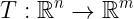
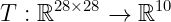

# [2주차 - Day2] 6강 선형변환

## 1. 선형함수 (Linear Function)
  - 함수 *f*가 아래 두가지 조건을 만족할 때 *f*를 선형함수라고 함
    - *f*(*x* + *y*) = *f*(*x*) + *f*(*y*)
    - *f*(*cx*) = *cf*(*x*)

## 2. 선형변환 (Linear Transform)
  - 변환
    - 함수의 입출력이 벡터인 함수  
    
    - n = m인 경우, 해당 변환을 연산자(operator)라고 함
    - EX) MNIST 손글씨 인식 문제
      - 28 x 28 입력을 받아 0~9로 분류  
        

  - 행렬변환 (Matrix Transform)
    - m x n 행렬 *A*에 대해 *A***x**는 n-Vector를 입력으로 받아 m-Vector를 출력하는 변환 T*A*(**x**) = *A***x**
    - 선형함수 성질을 만족하기 때문에 선형변환
    - 행렬은 선형변환의 구현체

## 3. 표준행렬 (Standard Matrix)
  - 행렬변환 코딩  
    1. 구현하려는 기능의 입력과 출력이 벡터로 정의되는지 확인
    2. 구현하려는 기능이 선형인지 확인
    3. 입력이 n-Vector이고 출력이 m-Vector이면 m x n 표준행렬을 구성

  - 표준행렬을 이용한 선형변환
    - m x n 표준행렬을 구성하여, 원하는 대로 동작하는 행렬변환 코딩 가능

  - 표준행렬 구하기
    - n-차원 표준 기저벡터 {**e**1,**e**2 , ..., **e**n}
    - 각 n-차원 표준 기적벡터에 **e****i**에 대해 원하는 기능을 동작시켜 얻은 결과인 m-차원 벡터 **T**(**e****i**)를 표준행랼의 각 열에 기록

  - ### EX 1
    - 2차원 벡터를 입력으로, 해당 벡터를 x축에 프로젝션
  - ### EX 2
    - 2차원 벡터를 입력으로, 해당 벡터를 반시계 방향으로 theta만큼 회전
