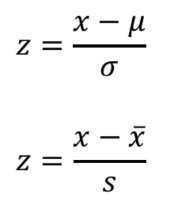

# [2주차 - Day3] 10강 통계학, 기본개념

## 1. 개념
  - 통계학 : 데이터의 수집, 구성, 분석, 해석, 표현에 관한 학문
  - 기술통계, 추측통계

  - 정의
    - 모집단 : 질문이나 실험을 위해 관심의 대상이 되는 개체, 사건의 집합
    - 모수 : 모집단의 수치적인 특성
    - 표본 : 모집단에서 선택된 개체, 사건의 집합

  - 도수
    - 사건이 실험이나 관찰로부터 발생한 횟수
    - 표현 : 도수분포표, 막대그래프(질적자료), 히스토그램(양적자료)
    - 양적자료(양적데이터)
      - 줄기-잎 그림
    - 상대도수 : 도수를 전체 원소의 수로 나눈 값

  - 평균(Mean)
  - 중앙값(Median)
    - 극단 값의 영향이 큰 평균 대신 사용
  - 분산(Variance)
  - 표준편차(Strandard Deviation)
  - z-score : 어떤 값이 평균으로부터 몇 표준편차 떨어져있는지 의미  
  
  
  - 범위(Range) : 자료를 정렬했을 때 가장 큰 값과 가장 작은 값의 차이
  - 사분위수(Quartile) : 전체 자료를 정렬했을 때, 1/4, 2/4, 3/4 위치에 있는 값
    - Q1 : 제 1사분위수, Q3 : 제 3사분위수
    - 사분위범위(IQR, InterQuartile Range) : Q3 - Q1

