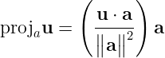

# [2주차 - Day3] 7강 벡터와 직교분해

## 1. 벡터의 표현
  - 좌표계 도입
    - **v** = (v1, v2, ..., vn)
    - 크기 : 
    - 방향 : 

  - 벡터의 내적
    - 
  
  - 직교
    - **u** · **v** = 0 <-> **u** ┴ **v**

  - 투영
    - 벡터 **u**, **a**
    - **u**를 **a**에 투영한 벡터 -> proja**u**
      - 
      - (기저 **a**에 대한 좌표값) · **a**
    - 투영하고 남은 벡터 -> 보완벡터(complement)
      - **u** - proja**u**
    - 투영벡터와 보완벡터는 항상 직교

## 2. 직교행렬
  - 직교 좌표계에 대한 행렬 표현
  
  - 직교행렬
    - 주어진 행렬의 모든 열벡터가 서로 직교
  - 정규직교행렬
    - 직교행렬 + 모든 열벡터의 크기가 1

  - 직교행렬을 이용한 선형시스템
    - *A***x** = **b**에서 **A**가 직교행렬이면, **x**는 역행렬 **A**-1의 계산 없이 구할 수 있다.
      - **x**의 *i*-번째 요소는 투영으로 계산 가능
      - 
      - 직교이므로 계산이 독립적 -> 병렬처리 가능

  - 정규직료행렬을 이용한 선형시스템
    - *A***x** = **b**에서 **A**가 직교행렬이면, **x**는 역행렬 **A**-1의 계산 없이 구할 수 있다.
      - **x**의 *i*-번째 요소는 내적으로 계산 가능
      - *x**i* = **b** · **a***i*
      - 직교이므로 계산이 독립적 -> 병렬처리 가능

## 3. QR 분해
  - 주어진 행렬에서 정규직교행렬 추출
  - 직교분할과 관련

  - *A* = *QR*
    - *Q* : 정규직교행렬
    - *R* : 상삼각행렬

  - *A***x** = **b**
    - (*QR*)**x** = **b** -> *Q*(*R***x**) = **b** -> *Q***y** = **b**
    - *Q*가 정규직교행렬이므로 내적을 통해 **y** 계산
    - *R*이 상삼각행렬이므로 후방대치법으로 **x** 계산

  - 그람-슈미트 과정의 코드화

  - 장점
    - *Q*를 이용한 부분에 병렬처리를 적용하여 빠른 계산 가능
    - *A***x** = **b**에서 *A*를 *QR*로 분해해두면 **b**가 업데이트 될 때 실시간으로 계산 가능

  - LU vs QR
    - LU : 병렬처리 X
    - QR : *Q*를 저장하기 위해 메모리 사용량 ↑