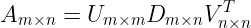
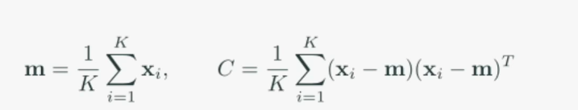
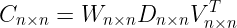

# [2주차 - Day3] 8강 SVD, PCA

## 1. 특이값 분해(SVD, Singular Value Decomposition)
  - 의미
    - 일반적인 m x n 행렬에 관한 분해
    - 직교분할, 확대축소, 차원변환 등

  - 분해
    - 
    - *U* : m차원 정규직교행렬 (회전행렬)
    - *D* : n차원 확대축소
    - *V* : n차원 정규직교행렬 (회전행렬)

  - 활용
    - *A*의 열벡터가 어느 방향으로 강한 응집성을 보이는지 분석
    - *U*, *D*, *V*의 열벡터를 순서대로 *p*개 취하면 강한 응집성을 가지는 *p*개의 방향에 수선의 발을 내린 근사치 *A*' 계산 가능

## 2. 주성분 분석(PCA, Principal Component Analysis)
  - 데이터의 공분산행렬에 대한 고유값 분해에 기반을 둔 직교분해
  - K개의 n차원 데이터 {**x***i*}K*i*=1
  - **m** : 데이터의 중심, *C* : 공분산행렬
    - 

  - 
    - W : n차원 회전행렬 (정규직교행렬)
    - D : n차원 확대축소
  