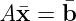

# [2주차 - Day3] 9강 벡터공간과 최소제곱법

## 1. 집합과 공간
  - 집합(Set) : 원소를 수집하여 만든 모음
    - 닫힘 : 어떤 연산에 대해 임의의 원소로 연산을 수행한 결과가 집합의 원소인 경우
      - {-1, 0, 1} -> 덧셈은 열림, 곱셈은 닫힘

  - 공간(Space) : 다음 두 연산에 닫혀 있는 집합
    - 덧셈
    - 스칼라 곱
    - 모든 n-Vector 집합 은 n차원 벡터 공간

  - 열 공간(Column Space)
    - 행렬 A의 열벡터들에 대한 가능한 모든 선형조합의 결과의 집합

## 2. 최소제곱법(Least Squares Method)
  - 열공간으로 투영
    - *A***x** = **b**에 대한 정확한 해가 없을 때 가능한 최선의 해를 계산
    - **b**를 *A*의 열공간으로 투영한 projW**b**

  - 최소제곱법
    - *A***x** = **b**에 대한 **x**가 없을 때, 최선의 해인 를 계산
      - 
    - **b**와 의 차이를 나타내는 벡터의 제곱길이를 최소화
    - 선형시스템의 양변에 전치행렬 *A*T를 곱하여 최소제곱법의 해를 계산 가능

  - 응용
    - 선형회귀
      1. 선형시스템 구성
      2. 최소제곱법 적용