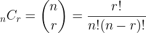
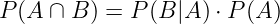
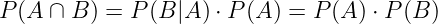

# [2주차 - Day4] 11강 확률-1

## 1. 확률
  - 똑같은 실험을 무수히 많이 반복할때 사건이 일어나는 비율
    - 상대도수의 극한

  - 표본 공간
    - 모든 가능한 실험 결과의 집합

  - 사건
    - 관심있는 실험 결과의 집합

  - 사건의 확률
    - 사건의 원소의 수 / 표본공간의 원소의 수
    
  - P(A) : 사건 A가 일어날 확률

## 2. 확률의 계산
  - 조합(Combination)
    - 어떤 집합에서 순서에 관계없이 뽑은 원소의 집합
    - nCr : n개 중 r개를 뽑는 조합의 수
    - 

  - 덧셈 법칙
    - 

  - 서로 배반
    - 두 사건의 교집합이 공집합

  - 조건부 확률
    - 어떤 사건 a가 일어났을때 사건 B가 일어날 확률
    - 
    - 곱셈 법칙
      - 

  - 서로 독립
    - *P(B|A)* = *P(B)* 인 경우
    - 