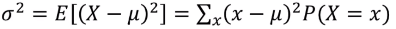

# [2주차 - Day4] 13강 확률 분포

## 1. 확률 변수 (Random Variable)
  - 랜덤한 실험 결과에 의존하는 실수
    - 표본공간의 부분 집합에 대응하는 실수
  - 표본공간에서 실수로 대응되는 함수로 정의
  - 표시 : 대문자(X, Y 등)

  - 이산확률변수 (Discrete)
    - 확률 변수가 취할 수 있는 모든 수 값을 하나씩 셀 수 있는 경우
    - 주사위, 동전

  - 연속확률변수 (Continuos)
    - 셀 수 없는 경우
    - 사람의 키

## 2. 확률 분포 (Probability Distribution)
  - 확률 변수가 가질 수 있는 값에 대해 확률을 대응시켜주는 관계
  - 표현 : 표, 그래프, 함수 등 다양함
  - EX) 주사위 2개를 던질 때
    - X : 주사위 눈의 합(X = 2,3,...,12)
    - Y : 주사위 눈의 차(Y = 0,1,...,5)
  - 평균과 분산을 가짐
    - n번 시행하면 n개의 결과(실수)가 나옴 -> 평균과 분산을 계산 가능
    - 모집단의 평균과 분산으로 간주 가능

  - 이산확률변수
    - 확률변수 X가 x인 확률
      - P(X=x) = *f*(x)
      - 확률질량함수
    - 평균
      - 기대값 (Expected Value)
      - 
    - 분산
      - *V*(X) or Var(x)
      - 의 평균
      - 
      - 
    - 표준편차
      - SD(X)
      - 분산의 제곱근

  - 결합확률분포 (Joint Probability Distribution)
    - 두 개 이상의 확률 변수가 동시에 취하는 값들에 대해 확률을 대응시켜주는 관계
    - 각 확률변수의 확률분포를 도출할 수 있음
      - 주변확률분포 (Marginal)

## 3. 공분산 (Covariance)
  - 사건 간의 관계성
  - Cov(X, Y)
  - 의 평균
  - Cov(X, Y) = E(XY)-E(X)E(Y)

## 4. 상관계수 (Correlation Coefficient)
  - Corr(X, Y)
  - 사건 간의 관계성
    - 공분산은 각 확률변수의 절대적인 크기에 영향을 받음
    - 따라서 단위에 의한 영향을 없앨 필요가 있음
  - 