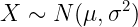
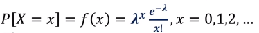

# [2주차 - Day4] 14강 몇 가지 확률분포

## 1. 이항분포
  - 이항확률변수의 확률분포

  - 베르누이 시행
    - 정확히 2개의 결과만을 가지는 실험
    - 성공확률 : *p*
  - 이항확률변수
    - n번의 베르누이 시행에서 성공의 횟수

  - 

  - 평균
    - *E(X)* = *np*
  - 분산
    - *V(X)* = *np*(1-*p*)
  - 표준편차
    - SD(*X*) = {*np*(1-*p*)}1/2

## 2. 정규분포
  - 연속확률변수의 확률분포
    - 확률밀도함수
    - 그래프 아래 부분의 넖이 = 확률
      - 

  - 정규분포의 확률밀도함수
    - 
    - 

  - 표준정규분포
    - 평균이 0, 편차가 1인 정규분포
    - 표준정규확률변수
      - 
    - *Z~N*(0, 1)

## 3. 포아송 분포
  - 일정한 시간단위 또는 공간단위에서 발생하는 이벤트의 수의 확률분포
    - EX) 하루동안 어떤 웹사이트의 방문자 수
  - 확률분포함수(확률질량함수)
    - 
      - 평균 : 
      - 분산 : 

## 4. 지수분포
  - 포아송 분포에 의해 어떤 사건이 발생할때, 한 시점에서 사건이 발생할 때까지 걸리는 시간에 대한 확률분포
  - 함수
    - 
  - 평균
    - *E(T)* = 1 / lambda
  - 분산
    - *V(T)* = 1 / lambda2
    