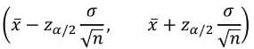
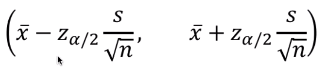
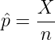
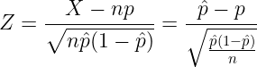
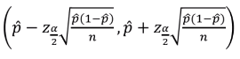

# [3주차 - Day1] 16강 추정

## 1. 모평균의 추정
  - 모집단이 정규분포
    - 표본평균 사용
    - 는 모평균   추정에 사용

  - 점추정
    - 표본평균이 점 추정값(추정량)
  - 구간추정
    - 모평균 의 100(1-a)% 신뢰구간
    - 정규분포에서 를 알 때
      - 
      - 실용적이지 못함
        - 정규분포가 아니거나, 표준편차가 알려져있지 않음
    - 표본의 크기가 클 때
      - 중심극한정리 사용
        - 
        - s : 표본표준편차

## 2. 모비율의 추정
  - 점추정
    - 확률변수 *X*
      - n개의 표본에서 특정 속성을 갖는 표본의 개수
    - 모비율 *p*의 점 추정량
      - 
  - 구간추정
    - n이 충분히 클 때
      - np > 5, n(1-p) > 5일 때
      - X~N(np, np(1-p))
    - 표준화
      - 
      - 근사적으로 표준정규분포 N(0, 1)을 따름
    - 모비율 *p*의 100(1-a)% 신뢰구간
      - 