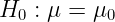
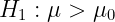
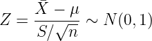
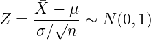

# [3주차 - Day1] 17강 검정

## 1.  통계적 가설검정
  - 가설 검정
    - 주장을 검증하는 것
    - 표본평균 bar(X)가 mu0보다 얼마나 커야 모평균 mu가 mu0보다 크다고 할 수 있는가
      - 표본의 선택에 따라 표본평균이 달라짐

    - 귀무가설 
    - 대립가설 
    - 귀무가설의 기긱을 위해서는 bar(X)가 큰 값이 필요
      - 귀무가설이 참으로 가정할 때 랜덤 선택한 표본에서 지금의 bar(X)가 나올 확률
      - 낮으면 귀무가설이 참이 아니라고 판단
    - 확률이 낮다 -> 기준 필요
      - 유의 수준 
    - P(bar(X) >= k) <= 가 되는 k
    - 표준정규확률변수로 변환 -> 검정통계량
      - 

    - 검정
      - H0, H1 설정
      - 유의수준  설정
      - 검정통계량 계산
      - 기각역, 임계값 계산
      - 유의성 판정

## 2. 모평균의 검정
  - 대립가설
    - 대립가설 채택을 위한 통계적 증거 확보 필요
    - 증거가 없으면 귀무가설 채택
  - 검정통계량
    - n >= 30인 경우
      - 중심극한정리
      - 
    - 정규모집단, 모표준편차가 있는 경우
      - 
    - 기타
      - p분포 등 기타 

  - 기각역
    - H0 : μ = 10.5
    - 유의수준 : α
    - H1 : μ > 10.5 -> Z > zα
    - H1 : μ < 10.5 -> Z < zα
    - H1 : μ >< 10.5 -> |Z| > zα/2