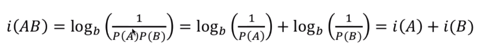
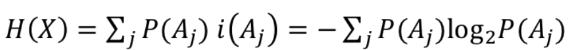
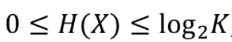
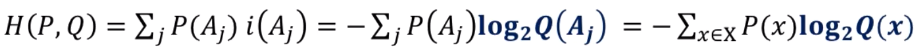
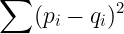

# [3주차 - Day1] 18강 교차 엔트로피

## 1. 엔트로피
  - 자기정보(Self-information)
    - *i*(A) = logb(1 / P(A)) = -logbP(A)
    - 확률이 높은 사건
      - 정보가 적음
    - 단위
      - b = 2 : bits
      - b = e : nats
      - b = 10 : hartleys
    - 특성
      - 

  - 엔트로피
    - 자기정보의 평균
      - 
    - 특성
      - 
      - K : 사건의 수
    - 활용
      - 평균 비트수를 표현
      - 데이터 압축에 사용 가능
    - *i*(X)의 활용
      - 평균 비트수

## 2. 교차 엔트로피 (Cross Entropy)
  - 확률분포 P, Q
    - S = {Aj}
      - P(Aj) : P에서 Aj 발생 확률
      - Q(Aj) : Q에서 Aj 발생 확률
      - *i*(Aj) : Q에서 Aj의 자기정보
        - *i*(Aj) = -log2Q(Aj)
        - 자기 정보는 Aj를 표현하는 비트수
        - 잘못된 확률분포를 사용하면 실제 최적의 비트수를 사용하지 못하게 됨
    
  - H(P,Q)
    - S상에서 P에 대한 Q의 교차 엔트로피
    - P에서 *i*(Aj)의 평균
      - 
      - 정확한 확률분포를 사용했을 때의 비트 수 보다 ↑
    - P와 Q가 얼마나 비슷한지 표현
      - 같으면 H(P,Q) = H(P)

  - 분류문제에서의 손실함수
    - 분류문제
      - 주어진 대상 = A ?
      - 주어진 대상이 A, B, C중 어느 것?
    - 기계학습에서는 대상이 각 그룹에 속할 확률을 제공
      - 정답[1.0, 0.0]과 얼마나 다른지 측정 필요
      - P, Q가 얼마나 다른지에 대한 척도 필요
    - 제곱합
      - 
      - 확률이 다를수록 큰 값
      - 속도 느림
    - 교차 엔트로피
      - 확률이 다를수록 큰 값
      - 속도 빠름
      -> 주로 사용
    - 참고 : 분류 문제에서의 정답
      - P = [p1, p2, ..., pn]
      - pi중 하나만 1, 나머지는 0
        - 엔트로피 H(P) = 0
        - pk = 1.0인경우 qk가 커지는 방향으로 진행