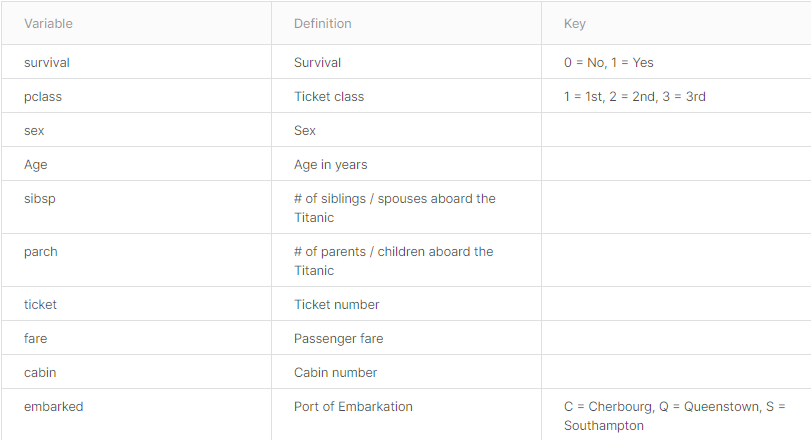

# [Week4 - Day3] 1강 EDA

## 1. EDA
  - 데이터 그 자체만으로부터 인사이트를 얻어내는 접근법

## 2. EDA Process
  1. 분석의 목적과 변수 확인
      - 분석의 목적을 명확히
  2. 데이터 전체적으로 살펴보기
      - 상관관계, NA, 사이즈(일반화)
  3. 데이터의 개별 속성 파악하기
      - 속성의 매칭 파악

## 3. Titanic
  1. 분석의 목적과 변수 확인
      - 살아남은 사람들에 대한 특징
      - 
      - NaN
        - Not a Number, 결측치
        - 다양한 처리 방법
          - fillna, dropna
        - 존재 자체로 단서가 되는 경우도 있음
  2. 데이터 전체적으로 살펴보기
      - `Dataframe.describe()`
        - 수치형 데이터에 대한 전체 정보
      - Outlier (이상점)
        - 결과적으로 잘못된 분석 결과를 초래할 수 있는 값
      - 상관계수
        - 상관계수는 인과율 X
  3. 데이터의 개별 속성파악하기
      - NaN 처리
      - 복합적인 요소의 분석