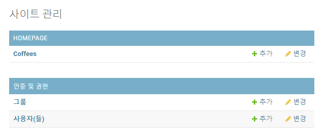
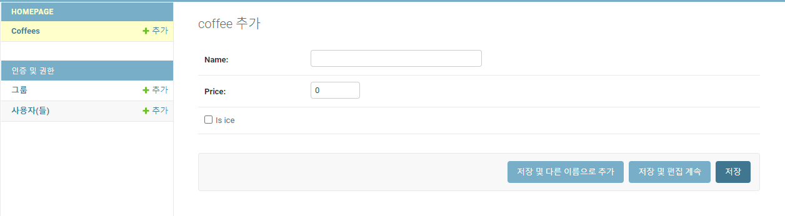
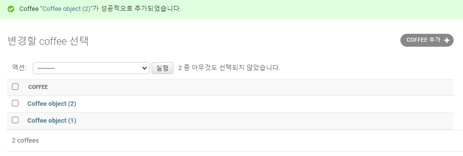
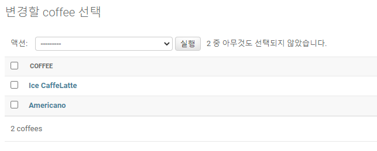

# [Week5 - Day2] 4-5강 Model

## 1. 데이터베이스
  - 데이터베이스 (DataBase)
    - 정보를 구조화
    - 참고 : Pandas.DataFrame
  - SQL (Structured Query Language)
    - DB의 자료를 처리하는 특수 목적의 프로그래밍 언어
    - 쿼리(질의)를 통해 데이터를 처리
  - ORM (Object Relational Mapping)
    - 객체와 관계형 DB의 데이터를 자동으로 매핑
    - Django에 모듈이 내장되어 있어 SQL 쿼리를 직접 작성할 필요 없이 DB 핸들링 가능

## 2. Django ORM
  - App의 models&#46;py 파일에 파이썬 클래스 형태로 선언
    - ``` python
      class ModelName(models.Model) :
          field1 = models.FieldType(...)
          field2 = models.FieldType(...)
          field3 = models.FieldType(...)
          ...
      ```
  - field = models.FieldType(...)
    - FieldType()의 파라미터로 필드의 속성 지정
      - ex) default, null, ...

## 3. 데이터베이스 관리
  - admin 페이지
    - App 내의 admin&#46;py
    - 모델을 자연스럽게 관리 할 수 있도록 함
    - ※ Groups과 Users도 DB 모델 형태로 관리
      
    - DB 관리를 위해서는 DB 모델을 settings&#46;py에 등록 필요
  - migrate
    - Django는 DB를 마이그레이션 단위로 저장, 관리
    - 새로운 DB를 위해서는 migrate 진행 필요
    - 과정
      ```
      python manage.py makemigrations <App 이름>
      
      python manage.py migrate
      ```
  - DB 페이지
    - 아이템 추가
      
    - 저장된 아이템 관리
      - 객체의 파이썬 클래스 \_\_str__ 메서드 출력에 따라 아이템 이름 표기
        - \_\_str__ 없을 때
          
        - \_\_str__ 있을 때
          

## 4. Template로 전달
  1. views&#46;py에서 DB 데이터를 불러와 render()의 파라미터로 전달
  2. 화면을 구성하는 템플릿 작성
  3. urls&#46;py에 url 등록
    