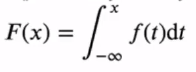
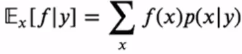

# [Week6 - Day1] ML_basics - Probability

## 소개
### 1-1 머신 러닝이란?
  - 경험을 통해 자동으로 개선하는 컴퓨터 알고리즘

### 1-2 핵심 개념
  - 학습
  - 시험 셋
  - 일반화
  - 지도학습
    - 분류
    - 회귀
  - 비지도학습
    - 군집
    
### EX) 다항식 곡선 근사
  - 입력벡터 : **X**, **t**
  - 목표 : 새로운 입력벡터가 주어질때 목표값을 예측
  - 확률이론 : 예측값의 불확실성을 정량화하여 표현할 수 있는 수학적인 프레임워크 제공
  - 결정이론 : 확률적 표현을 바탕으로 최적의 예측을 수행할 수 있는 방법론을 제공
  - 
  - 오차함수
    - 과소적합, 과대적합에 주의

## 확률이론 
### 2-1 확률변수 (Ramdom Variable)
  - 표본 집합 *S*의 원소 *e*를 실수값 *X*(*e*) = *x*에 대응시키는 함수
    - 알파벳 대문자 : 확률변수
    - 알파벳 소문자 : 확률변수가 가질 수 있는 값
    - 확률 *P*는 집합 *S*의 부분집합을 실수값에 대응시키는 함수
      - *P*[*X* = *x*], *P*[*X* <= *x*] 등
      - *X* = *x*, *X* <= *x*는 집합 *S*의 부분집합을 정의

### 2-2 연속확률변수
  - 누적분포함수(Cumulative Distribution Function, CDF) *F(x) = P*[*X  (-inf, x)*]
  - *F(x)* 를 가진 확률변수 *X*에 대해 다음을 만족하는 함수 *f(x)* 가 존재한다면 *X*는 연속확률변수
    - *f(x)* 는 *X* 의 확률밀도함수(Probability Density Function, pdf)
    - 
  - 혼란을 방지하기 위해 *FX(x)*, *fX(x)* 로 표기하기도 함
    - *pX(x)*, *px(x)*, *p(x)* 를 사용하기도 함
    - 

### 2-3 확률변수의 성질
  - 덧셈법칙
    - 
  - 곱셈법칙
    - 
  - 베이즈 확률(베이즈 이론)
    - 
    - posterior : 사후확률
    - likelihood : 가능도
    - prior : 사전확률
    - normalization : Y와 상관없는 상수, *p(X)*

### 2-4 확률변수의 함수
#### 2-4-1 확률변수 *X*의 함수 *Y*=*f(X)* -> 확률변수
  - *k*차원의 확률변수 벡터 **x**가 주어졌을 때, *k*개의 **x**에 관한 함수들 *yi* = *gi(**x**)* for(1~*k*)는 새로운 확률변수벡터 **y**를 정의
    - **y** = **g**(**x**)로 표현
    - if) **y** = **g**(**x**)가 일대일 변환인 경우 **y**의 결합확률밀도함수
      - 
    - Jacobian?
      - https://ko.wikipedia.org/wiki/야코비_행렬

#### 2-4-2 Inverse CDF Technique
  - 확률변수 X에 대한 CDF(누적분포함수) *FX(x)*
  - 연속확률분포함수 *U* ~ UNIF(0,1)의 함수로 정의되는 확률변수 Y
    - *Y* = *F**X*-1(*U*)
  - 확률변수 *Y*는 확률변수 *X*와 동일한 분포를 따르게 됨
    - 

#### 2-4-3 반경이 *r*인 원 안에 랜덤하게 점을 찍는 프로그램
  - 주피터로 찍어보기

### 2-5 기댓값 (Expectations)
  - 확률분포 *p(x)* 하에서 함수 *f(x)* 의 평균값 *E[f]*
    - 이산확률분포
      - 
    - 연속확률분포
      - 
  - 확률분포로부터 *N*개의 샘플을 추출해서 기댓값 근사 가능
    - 
  - 조건부 기댓값
    - 

### 2-6 분산, 공분산
  - *f(x)* 의 분산 : *f(x)* 의 값이 기댓값으로부터 흩어져 있는 정도
  - var[*f*] = *E[f 2]* - *E[f]*2
  - var[*x*] = *E*(*x*2) - *E*(*x*)2
  - 확률변수 *x*, *y*에 대한 공분산
    - cov[*x*, *y*] = *E*(*x*, *y*) - *E*(*x*)*E*(*y*)
  - 확률변수 벡터 **x**, **y**
    - cov[**x**, **y**] = E(**x**, **y***T*) - E(**x**)E(**y***T*)

### 2-7 Frequentist(빈도주의) VS Bayesian(베이지안)
  - 빈도주의 : 반복가능한 사건들의 빈도수에 기반
  - 베이지안 : 불확실성을 정량적으로 표현
    - 반복가능하지 않은 사건일 경우
  - Bayesian
    - 모델의 파라미터 **w**에 대한 지식을 확률적으로 표현
    - **w**에 대한 사전지식 *p(w)* -> 사전확률(prior)
    - 새로운 데이터 *D* 를 관찰하고 난 뒤의 조건부 확률 *P(D|**w**)* -> 가능도(likelihood)
    - 장점
      - 사전확률을 모델에 포함 가능
      - EX) 동전을 던져서 3번 모두 앞면
        - 빈도주의 -> 앞면이 나올 확률 = 1
        - 베이지안 -> 극단적인 확률 회피
  - Frequentist
    - **w**가 고정된 파라미터이고 최대가능도와 같은 추정자(estimator)를 사용해서 값을 계산

## 정규분포
### 3-1 정규분포
  - 단일변수 *x*를 위한 가우시안 분포  
    
  - 정규화  
    
  - 기댓값  
    
  - 분산  
    
  - 최대가능도해 (Maximum Likelihood Solution)
    - 점추정 방식 중 하나
    - 어떤 확률변수에서 추출한 표본들을 토대로 확률변수의 모수를 구하는 해
    - 어떤 모수가 주어질 때, 원하는 값이 나올 가능도를 최대로 만드는 모수
    - 

## 곡선근사 (Curve Fitting)
### 4-1 확률적 관점
  - 학습데이터 **X**, **t**
  - 확률분포  
    
  - 파라미터 **w**, *\beta*
    - 가능도 함수  
      
    - 로그 가능도 함수  
      
    - **w**에 관해서 가능도 함수를 최대화 시키는 것은 제곱합 오차함수의 최소화와 동일
      - **w**의 사후확률은 가능도 함수와 사전확률의 곱에 비례
      - 사후확률의 최대화 == 규제화된 제곱 합 오차함수의 최소화

### 4-2 Bayesian Curve Fitting
  - **w**의 분포로부터 확률의 기본법칙만을 사용해서 *t*의 예측분포를 유도
  - 
  