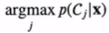

# [Week6 - Day2] Desicion Theory & Linear Regression

## 결정이론
  - 새로운 값 **x**가 주어졌을 때 확률모델 *p*(**x**, **t**)에 기반해 최적의 결정 판단
    - 추론 : 결합확률분포 *p*(**x**, *Ck*)를 구하는 것
    - 결정 : 상황에 대한 확률이 주어졌을 때 어떻게 최적의 결정을 내리는가?

### 1-1 이진분류 (Binary Classification)
  - 결정영역 (Decision Region)
    - *Ri* = { *x* : pred(*x*) = *Ci* }
  - 분류오류 확률
    - 
  - 오류를 최소화하려면 다음조건을 만족하면 x를 Ri에 할당
    - 
  - ※ MultiClass일 경우
    - pred(*x*) = argmaxkp(*Ck*|*x*)

### 1-2 결정이론의 목표
  - 결합확률분포 *p*(**x**, *Ck*)가 주어졌을 때 최적의 결정영역들 *R*을 찾는 것
    - 결합확률분포 *p*(**x**, *Ck*)가 주어졌을 때 최적의 함수 를 찾는 것

#### 1-2-1 기대손실 최소화
  - 모든 결정이 동일한 리스크 X
  - 손실행렬 (Loss Matrix)
    - *Lkj* : *Ck* 에 속하는 **x**를 *Cj* 로 분류할 때 발생하는 손실
    - 손실행렬 *L*이 주어졌을 때
    - 
    - 
    - 범함수 E(*L*)을 최소화시키는 \hat{C}(*x*)
      - 
    - 손실행렬이 0-1 Loss인 경우
      - 

#### 1-2-2 예제 : 의료진단 -> Jupyter!
  - *Ck* = {1, 2} <-> {sick, healthy}
  - *L* = [[0, 100], [1, 0]]

#### 1-2-3 회귀문제
  - 목표값 : *t* \in *R*
  - 손실함수 : *L*(*t*, *y*(**x**)) = {y(**x**) - *t*}2
    - 
  - **x**를 위한 최적의 예측값은 *y*(**x**) = *Et*[*t*|*x*]
    - 오일러-라그랑주 방정식
      - 
      - 회귀에서 *F*[*y*] = *E*[*L*] = 
    - 손실함수의 분해
      - 
      - 편미분을 2번 진행하면서 교차항들이 사라짐
      - 

## 결정문제를 위한 방법들
### 2-1 분류문제
  - 확률모델에 의존
    - 생성모델 : 각 클래스에 대해 분포와 사전확률을 구하고 베이즈정리를 사용하여 사후확률 계산
    - 식별모델 : 모든 분포를 전부 계산하지 않고 사후확률만 계산
    - 사후확률이 주어지기 때문에 결정이 쉽게 이루어질 수 있음
  - 판별함수에 의존
    - 입력을 클래스로 할당하는 판별함수를 탐색
    - 확률 계산 X

### 2-2 회귀문제
  - 결합분포를 구하는 추론문제를 먼저 해결 후 조건부확률분포 계산 -> 주변화를 통해 기댓값 계산
  - 조건부확률분포를 구하는 추론문제를 해결 -> 주변화를 통해 기댓값 계산
  - *y*(**x**)를 직접 계산

## 선형 회귀
  - scikit-learn 패키지
  - model 선언
  - `model.fit()`

### 3-1 선형회귀 모델
  - `model = sklearn.linear_model.LinearRegression`
  - 1차원 선형모델
    - 기울기 : `model.coef_[0]`
    - y절편 : `model.intercept_`
  - 다차원 선형모델
    - 각 항의 계수 : `model.coef_`
    - y절편 : `model.intercept_`

### 3-2 선형 기저함수 모델
  - 비선형 데이터를 선형함수로 모델링
  - *xn* = *fn*(*x*)으로 하는 기저함수로 변환

#### 3-2-1다항 기저함수
  - `sklearn.preprocessing.PolynomialFeatures`
    - 차원 변환 Transformer
  - `sklearn.pipeline.make_pipeline`
    - 파이프라인 적용
  - 위 둘을 통해 기저함수를 통한 선형모델을 제작

#### 3-2-2 가우시안 기저함수
  - 
  - scikit-learn 미포함
  - 과적합
    - 지나치게 많은 기저함수
    - 규제화(Regularization)를 통해 해결
      
### 3-3 규제화  
  - Ridge Regression (*L*2 Regularization)
    - 
    - 제곱합
    - 모델 : `sklearn.linear_model.Ridge`
    - \alpha 는 규제화의 강도를 조절하는 파라미터

  - Lasso Regression (*L*1 Regularization)
    - 
    - 계수들의 절대값의 합을 제한
    - 모델 : `sklearn.linear_model.Lasso`
    - \alpha 는 규제화의 강도를 조절하는 파라미터

  - Stochastic Gradient Descent(SGD)
    - 확률적 경사 하강법
    - 모델 : `sklearn.linear_model.SGDRegressor`
    