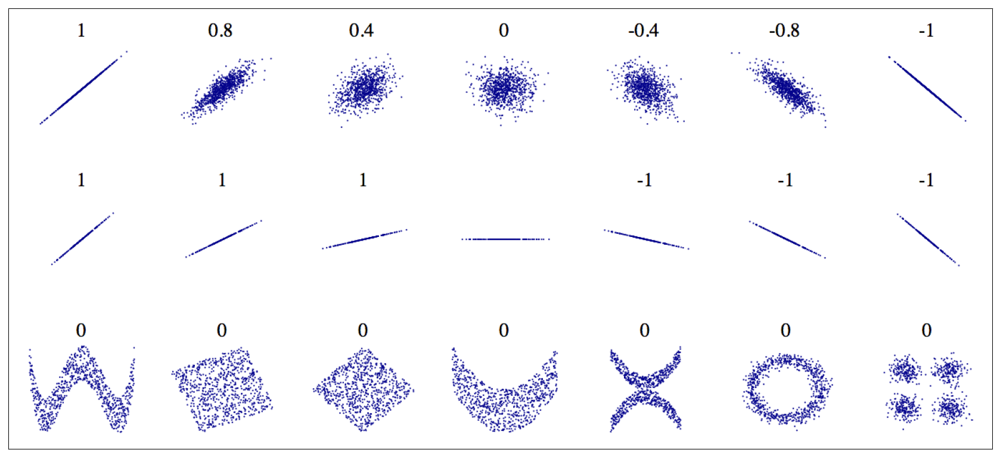

# [Week6 - Day2] E2E (End to End)

## 주요 단계
  1. 빅 픽쳐를 봐야한다
    - <del>역시 빅 픽쳐.....</del>
  2. 데이터 수집
  3. 데이터 탐색과 시각화
  4. 머신러닝 입력을 위한 데이터 전처리 실행
  5. 모델 선택, 훈련
  6. 모델 세부 조정
  7. 솔루션 제시
  8. 시스템 런칭, 모니터링, 유지보수

## 1. 큰 그림 보기
  - 문제 정의
  - 성능측정지표 선택
    - RMSE (평균 제곱근 오차)

## 2. 데이터 수집
  - 환경 설정
  - 데이터 훑어보기
    - 데이터 구조 확인
        - `DataFrame.head()`
        - `DataFrame.info()`
    - 숫자형 정보들의 요약
      - `DataFrame.describe()`
    - 히스토그램
      - `DataFrame.hist(bins)`
  - 테스트 데이터셋 생성
    - 프로젝트 초기에는 일반적으로 전체 데이터셋을 훈련셋과 테스트셋으로 분리
    - 계층적 샘플링
      - 전체 데이터를 계층(Strata)으로 나누고, 테스트셋이 전체 데이터셋을 잘 대표하도록 각 계층에서 올바른 수의 샘플을 추출

## 3. 데이터 탐색, 시각화
  - 지리적 데이터
  - 상관관계 관찰
    - 
  - 여러 특성을 조합하여 새로운 특성 정의

## 4. 데이터 전처리
  - 수동변환
  - 자동변환
    - 새로운 데이터에 대현 변환 용이
    - 향후 재사용 가능
    - 여러 변환법을 쉽게 시도
  - 데이터 정제(Cleaning)
    - null값
      - 추정값으로 채워넣기
      - 데이터셋에서 제거
  - 추정, 변환, 예측
    - Estimator : 데이터셋을 기반으로 모델 파라미터를 추정하는 객체
    - Transformer : 데이터셋을 변환하는 Estimator
    - Predictor : 새로운 데이터셋에 대해 예측값을 생성하는 Estimator
  - 텍스트와 범주형 처리
    - 데이터를 숫자형으로 변환
      - Ordinal Encoding
        - 특성의 값이 비슷할수록 샘플이 비슷하다는 가정이 성립해야 모델 학습이 쉬워짐
      - One Hot Encoding
        - Sparse Matrix(희소행렬)로 출력
          - https://ko.wikipedia.org/wiki/희소행렬
      - Custom Transformer 생성
        - `fit()`
        - `transform()`
  - 특성 스케일링
    - 특성간의 범위가 다르면 학습에 어려움이 생길 수 있음
    - min-MAX Scailing
    - Standardization (표준화)
  - 변환 파이프라인 (Transformation Pipelines)
    - 여러 변환을 순차적으로 진행하는 경우에 편리
    - `sklearn.compose.ColumnTransformer`
      - 각 Column마다 다른 파이프라인 적용

## 5. 모델 선택, 학습
  - 모델 클래스 임포트
  - 모델 생성
  - 모델 학습
  - 성능 측정
    - RMSE 
  - 평가
    - 테스트셋을 이용
    - 학습셋의 일부를 검증셋으로 분리
    - k-Fold Cross Validation (교차 검증)

## 6. 모델 세부 조정 (Tuning)
  - 모델 학습을 위한 최적의 하이퍼파라미터를 탐색
  - Grid Search
    - 특정 조합에서 탐색
  - Randomized Search
    - 하이퍼파라미터 조합의 수가 큰 경우
  - 특성의 중요도와 에러 분석

## 7. 모델 최종 평가

## 8. 런칭, 모니터링, 유지 보수
  - 모니터링
    - 시간이 지나면 모델이 낙후되면서 성능저하
    - 자동 모니터링
    - 수동 모니터링
  - 유지보수
    - 정기적인 데이터 수집
    - 새로운 데이터를 테스트로, 현재 테스트셋을 학습셋으로
    - 새로운 테스트셋에 기반해 새로운 모델 평가
