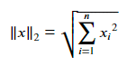
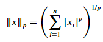
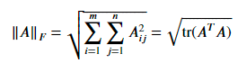

# [Week6 - Day2] Linear Algebra

## 행렬과 벡터
  - *A* \in *R*m x n : m행 n열 행렬
  - *x* in *R*n : n개 원소를 가진 벡터(열벡터)
    - 행벡터는 *A*T로 표현 (T:Transpose)
  - in Python 
    - numpy array를 사용하여 행렬과 벡터를 표현

### 1-1 곱셈
  - 벡터 X 벡터
    - 내적 (inner product, dot product, 스칼라곱)
      - in Python
        - `x.dot(y)`
    - 외적 (outer product, 벡터곱)
      - in Python
        - `x.matmul(y)`
        - `x * y`
  - 행렬 X 벡터
  - 행렬 X 행렬

### 1-2 중요 연산, 성질
  - 정방행렬(Square)
    - 행과 열의 개수가 동일한 행렬
  - 삼각행렬(Triangular)
    - 상삼각행렬 : 주대각선 아래 원소가 모두 0인 정방행렬
    - 하삼각행렬 : 주대각선 위 원소가 모두 0인 정방행렬
  - 대각행렬(Diagonal)
    - 주대각선을 제외한 모든 원소가 0인 정방행렬
  - 단위행렬(Identity)
    - 주대각선 원소가 모두 1인 대각행렬
  - 전치(Transpose)
    - *Aij* = *ATji*
  - 대칭행렬(Symmetic)
    - *A* 와 *AT* 가 동일한 경우
    - *A* = -*AT* 인 경우에는 반대칭으로 표현
    - *AAT* 는 항상 대칭
  - 대각합(Trace)
    - tr(*A*) (= tr*A*)
    - 주대각선의 원소들의 합
    - tr*A* = tr*AT*
    - tr(*A* + *B*) = tr*A* + tr*B*
    - *AB*가 정방행렬일때 tr*AB* = tr*BA*
    - *ABC*가 정방행렬일 때, tr*ABC* = tr*BCA* = tr*CAB*
  - Norms(노름)
    - 벡터의 길이
    - *l*2 norm (유클리드 노름)
      - 
    - *lp* norm
      - 
    - Frobenius norm
      - 
