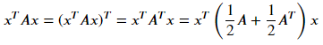
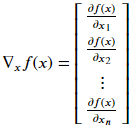
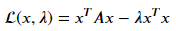

# [Week6 - Day2] Linear Algebra, Matrix Calculus

## 1 기본 표기법
  - *A* \in *R*m x n : m행 n열 행렬
  - *x* in *R*n : n개 원소를 가진 벡터(열벡터)
    - 행벡터는 *A*T로 표현 (T:Transpose)
  - in Python 
    - numpy array를 사용하여 행렬과 벡터를 표현

## 2 곱셈
  - 벡터 X 벡터
    - 내적 (inner product, dot product, 스칼라곱)
      - in Python
        - `x.dot(y)`
    - 외적 (outer product, 벡터곱)
      - in Python
        - `x.matmul(y)`
        - `x * y`
  - 행렬 X 벡터
  - 행렬 X 행렬

## 3 중요 연산, 성질
  - 정방행렬(Square)
    - 행과 열의 개수가 동일한 행렬
  - 삼각행렬(Triangular)
    - 상삼각행렬 : 주대각선 아래 원소가 모두 0인 정방행렬
    - 하삼각행렬 : 주대각선 위 원소가 모두 0인 정방행렬
  - 대각행렬(Diagonal)
    - 주대각선을 제외한 모든 원소가 0인 정방행렬
  - 단위행렬(Identity)
    - 주대각선 원소가 모두 1인 대각행렬
### 3-1 전치(Transpose)
  - *Aij* = *ATji*

### 3-2 대칭행렬(Symmetic)
  - *A* 와 *AT* 가 동일한 경우
  - *A* = -*AT* 인 경우에는 반대칭으로 표현
  - *AAT* 는 항상 대칭

### 3-3 대각합(Trace)
  - tr(*A*) (= tr*A*)
  - 주대각선의 원소들의 합
  - tr*A* = tr*AT*
  - tr(*A* + *B*) = tr*A* + tr*B*
  - *AB*가 정방행렬일때 tr*AB* = tr*BA*
  - *ABC*가 정방행렬일 때, tr*ABC* = tr*BCA* = tr*CAB*

### 3-4 Norms(노름)
  - 벡터의 길이
  - *l*2 norm (유클리드 노름)
    - 
  - *lp* norm
    - 
  - Frobenius norm
    - 
  - in Python
    - `numpy.linalg.norm()`

### 3-5 선형독립
  - 벡터들의 집합에 속해 있는 어떤 벡터도 나머지 벡터들의 선형 조합으로 나타낼 수 없을 때
  - 어떠한 벡터가 나머지 벡터들의 선형조합으로 나타내진 경우에는 선형 종속

### 3-6 Rank
  - Coulmn Rank : 행렬의 열들의 부분집합 중에서 가장 큰 선형독립인 집합의 크기
  - Row Rank : 행렬의 행들의 부분집합 중에서 가장 큰 선형독립인 집합의 크기
  - 모든 행렬의 Column Rank = Row Rank
  - 표기 : rank(*A*)
  - rank(*A*) = min(m, n)일 때, A는 Full Rank
  - rank(*A*) = rank(*AT*)
  - rank(*A* + *B*) <= min(rank(*A*), rank(*B*))
  - rank(*A* + *B*) <= rank(*A*) + rank(*B*)
  - in Python
    - `numpy.linalg.matrix_rank()`

### 3-7 역행렬(Inverse)
  - *AA-1* = *I* = *A-1A*
  - *A* 의 역행렬이 존재할 때 *A* 를 invertible 또는 Non-singular
  - *A* 가 full rank여야함
  - in Python
    - `numpy.linalg.inv()`

### 3-8 직교 행렬 (Orthogonal Matrices)
  - *xTy* = 0 를 성립하는 두 벡터 *x*, *y*
  - ||x||2 = 1 인 벡터를 정규화된 벡터
  - 모든 열들이 서로 직교이고 정규화된 정방행렬 U에 대해
    - *UTU* = *I* = *UUT*
    - *U*-1 = *UT*
    - ||*Ux*||2 = ||*x*||2

### 3-9 치역(Range), 영공간 (Nullspace)
  - 치역
    - 행렬 *A*의 치역 *R*(*A*)는 모든 열들에 대한 생성(span)
  - 영공간
    - 행렬 *A*의 치역 *N*(*A*)는 *A*와 곱해졌을 때 0이 되는 모든 벡터들의 집합
    - 
  - *R*(*AT*), *N*(*A*)를 직교여공간(Orthogonal complements)이라 부름, *R*(*AT*) = *N*(*A*)ㅗ

### 3-10 투영 (Projection)
  - 

### 3-11 행렬식 (Determinant)
  - |*A*| 또는 det *A*
  - in Python
    - `numpy.linalg.det()`
  - 행렬의 행 벡터들의 선형조합이 나타내는 *R*n* 공간 상의 모든 점들의 집합 *S*
    - 행렬식의 절대값 = *S* 의 부피
  - |*I*| = 1
  - *A* 의 하나의 행에 t를 곱했을 때 행렬식은 *t*|*A*|
  - *A* 의 두 행을 교환하면 행렬식은 -|*A*|
  - |*A*| = |*AT*|
  - |*AB*| = |*A*||*B*|
  - |*A*| = 0이면 *S*는 부피가 0인 형태
  - *A*가 non-singular이면 |*A*-1| = 1 / |*A*|

### 3-12 이차형식 (Quadratic Forms)
  - 정방행렬 *A* 와 벡터 *x* 에 대해 *xTAx*
  - 
  - 대칭행렬 *A*가 0이 아닌 모든 벡터 *x*에 대해 
    - *xTAx* > 0
      - 양의 정부호(Positive Definite), A > 0로 표시, 정부호 행렬의 집합을 *Sn*++로 표시
    - *xTAx* >= 0
      - 양의 준정부호(Positive semi-Definite), A >= 0로 표시, 준정부호 행렬의 집합을 *Sn*+로 표시
    - *xTAx* < 0
      - 음의 정부호(Negative Definite), A < 0로 표시
    - *xTAx* <= 0
      - 음의 준정부호(Negative semi-Definite), A <= 0로 표시, *S*n++
    - *A* 가 양의 준정부호, 음의 준정부호가 아닌 경우 부정부호(indefinite)
    - 양의 정부호, 음의 정부호 행렬은 full rank -> 역행렬 존재
  - Gram Matrix
    - 행렬 *Am x n* 에 대해 행렬 *G* = *ATA*
    - 항상 Positive semi-Definite
    - m >= n이고 *A* 가 full rank이면 *G*는 positive definite

## 3-13 고유값(Eigen Values), 고유벡터(Eigen Vectors)
  - 정방행렬 *A* 에 대해 *Ax* = \lambda x를 만족하는 \lambda를 *A*의 고유값, *x* 를 고유벡터
  - in Python
    - `numpy.linalg.eig() -> \lambda, x`
  - 
  - 모든 고유값과 고유벡터를 하나의 식으로 표현
    - *AX* = *X*\Lambda
  - 대칭행렬 *A* 에 대해
    - *A* 의 모든 고유값은 실수
    - *A* 의 고유벡터들은 직교한다.
    - *A* = *U*\Lambda*U*T 에 대해
      - 
    - 모든 \lambda*i* > 0이면, *A* 는 양의 정부호
    - 모든 \lambda*i* >= 0이면, *A* 는 양의 준정부호

## 4 행렬미분
### 4-1 The Gradient
  - 행렬 *A* 를 입력으로 받아서 실수값을 반환하는 함수 *f*
    - 
  - *A*가 벡터 *x* 인 경우
    - 

### 4-2 The Hessian
  - 
  - 

## 5 적용 예제
### 5-1 최소제곱법 (Least Squares)
  - 행렬 *A* 와 벡터 *b* 에 대해 *b* \notin *R*(*A*)인 경우, *Ax* = *b* 를 만족하는 벡터 *x*는 존재 X, 대신 *Ax* 와 *b* 가 최대한 가까워지는 *x*를 탐색
    - ||*Ax - b*||22 를 최소화시키는 *x*를 탐색
    - 
    - *x* = (*ATA*)-1*ATb*

### 5-2 고유값과 최적화문제 (Eigen Values as Optimization)
  - 행렬미분을 통해 풀면 고유값이 최적해가 되는 형태
    - 
  - 제약조건이 있는 최소화문제 -> Lagrangian(라그랑지안)을 사용
    - 
    -  를 만족해야 함
    - 최적해 *x*는 *Ax* = \lambda x 를 만족 -> *A*의 고유벡터만이 최적해
    -  를 만족
      - 가장 큰 고유값에 해당하는 고유벡터가 최적해

### 5-3 Autoencoder, Principal Componenets Analysis (PCA, 주성분 분석)
  - Autoencoder 응용
    - Dimensionality Reduction (차원 축소)
    - Image Compression (이미지 비교)
    - Image Denoising (이미지 노이즈 제거)
    - Feature Extraction (특징점 추출)
    - Image generation (이미지 생성)
    - Sequence to sequence prediction
    - Recommendation system (추천 시스템)

#### 5-3-1 PCA (주성분 분석)
  - *m*개의 점들에 대해 각각의 점을 *l* 차원의 공간으로 투영시키는 함수 *f*(*x*) = c \in *Rl* (인코딩 함수)
  - 투영된 값을 다시 *n* 차원의 공간으로 회복하는 함수 *g*(*c*) (디코딩 함수)
    - *x* \approx *g*(*f*(*x*))
  - 디코딩 함수
    - *g*(*c*) = *Dc*
    - *D*는 열들이 정규화되어 있고 서로 직교하는 경우로 한정
  - 인코딩 함수
    - 디코딩 함수에 대한 최적의 인코딩 함수 탐색 문제
      - 
    - Euler-Lagrange 방정식으로 해결
      - 
      - *c* = *DTx* -> *f*(*x*) = *DTx*
  - 최적의 *D* 탐색
    - 입력값 *x*와 출력값 *g*(*f*(*x*)) 사이의 거리가 최소화되는 *D*
    - 에러행렬 *E* = *X* - *R*
    - 최적의 *D* -> 
    -  
    - *dTidi* = 1 -> *XTX* 의 가장 큰 *l* 개의 고유값에 해당하는 고유벡터들일 때,  이 최대화
