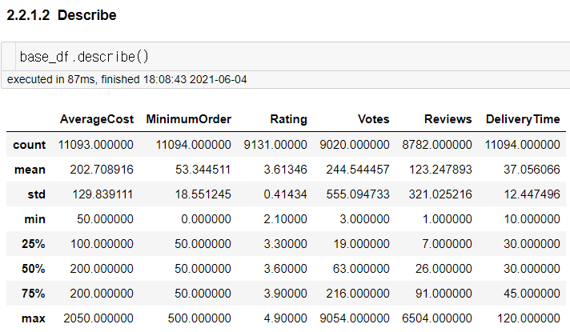
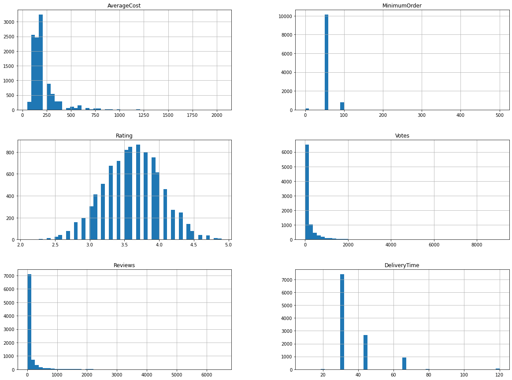
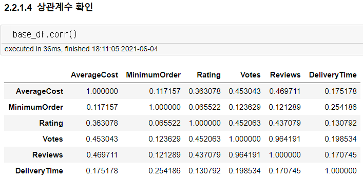

# [Week6 - Day5] Mission Log

## 테스트 데이터셋 분리
  - `sklearn.model_selection.train_test_split()`

## 구조 훑어보기
  - AverageCost -> 숫자형으로 변환
  - Rating -> 숫자형으로 변환
    - `DataFrame.interpolation()` 통한 보간법 적용하기
      - method = `'pad'`
  - Describe
    - 
  - Histogram
    - 
  - Correlation
    - 
  - Location Column
    - 인코더를 통해 자료형 변환하기

## Data Cleaning
  - AverageCost
    - `replace()`를 통해 ','를 제거 -> ''로 치환
    - 숫자형으로 바꿔지지 않는 데이터들을 `np.NaN`으로 치환
    - `Series.astype(np.float64)` 적용하여 숫자형으로 변환
    - `DataFrame.interpolate()`를 통해 NaN 보간 적용
  - Rating
    - `replace()`를 통해 숫자가 아닌 데이터들을 `np.NaN`으로 치환
    - `Series.astype(np.float64)` 적용하여 숫자형으로 변환
    - `DataFrame.interpolate()`를 통해 NaN 보간 적용
  - Location
    - 비슷한 지명간에 비슷한 값을 갖도록 주소 표기를 역순으로 변경
    - Location과 DeliveryTime 평균이 유의미한 상관관계를 갖도록 딕셔너리 생성
    - `Series.map()` 을 적용하여 Column이 숫자형 데이터를 가지도록 변환
  - Cuisines
    - `sklearn.feature_extraction.text.CountVectorizer`
    - `Series.str.replace()`를 적용하여 공백을 제거
    - `Series.str.split()`를 적용하여 리스트 형태로 변환
    - `CountVectorizer` 사용을 위해 ' '문자로 구분된 스트링 형태로 변환
    - `CountVectorizer.fit_transform()` 으로 데이터를 `np.array` 형태로 변환
    - `np.array` 형태를 `pd.DataFrame` 형태로 변환
      - columns 파라미터에 `CountVectorizer.vocabulary_`를 정렬된 상태로 전달
      - index 파라미터에 기존 인덱스를 그대로 전달
    - `pd.concat()`을 사용하여 생성한 데이터프레임을 학습셋에 포함
    - 기존의 column을 삭제
  - Votes, Reviews
    - 학습셋을 Rating column 기준으로 정렬

  