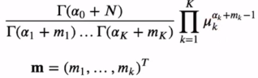

# [Wek7 - Day1] 확률분포 1 - 이산확률분포

## 1. 밀도 추정 (Density Estimation)
  - N개의 관찰 데이터가 주어졌을 때 분포함수 *p*(*x*)를 탐색
  - 과정
    1. *p*(*x*)를 파라미터화된 분포로 가정
      - 회귀, 분류 문제에서는 주로 *p*(*t*|**x**), *p*(*C*|**x**)를 추정
    2. 분포의 파라미터를 탐색
      - 빈도주의 : 어떤 기준을 최적화시키는 과정을 통해 파라미터 값을 지정. 파라미터 하나의 값을 탐색
      - 베이지안 : 파라미터의 사전확률을 가정 -> 베이즈 규칙을 통해 파라미터의 사후확률을 계산
    3. 탐색된 파라미터를 사용해 문제를 예측
  - 켤레사전분포 (Conjugate Prior) : 사후확률이 사전확률과 동일한 함수형태를 가지도록 해줌

## 2. 이항변수 (Binary Variables)
### 2-1 빈도주의 방법
  - 이항 확률변수 *x* \in {0, 1}
    - 를 만족
  - *p*(*x*)는 베르누이 분포로 표현
    - 
  - 기댓값 *E*(*x*) = \mu
  - 분산 var(*x*) = \mu(1 - \mu)
  - 우도함수
    - *x*를 *N*번 관찰한 결과를 *D*, 각 *x*가 독립적으로 *p*(*x*|\mu)에서 뽑힌다고 가정
      - 
    - 로그우도함수
      - 
    - 우도함수를 최대화시키는 값으로 계산
    - \mu의 최대우도 추정치 (Maximum Likelihood Estimate)
      - 
      - N이 작은 경우에 MLE는 과적합된 결과가 나올 수 있음

### 2-2 베이지안 방법
  - 이항분포 (Binomial Distribution)
    - *D* = {*x*1, ... *x**N*}, *x*가 1인 경우를 *m* 번 관찰할 확률
    - Bin(*m*|*N*,\mu) = (*N*, *m*)\mu*m*(1-\mu)*N*-*m*
    - *E*(*m*) = *N*\mu
    - var(*m*) = *N*\mu(1 - \mu)
  - 데이터를 보는 관점
    - 베르누이 시행의 반복 : *x* 각각이 확률변수
    - *x*가 1인 경우 관찰 횟수 : 하나의 확률변수 *m*
    - 베이지안 방법을 위해서 데이터의 우도를 계산해야함
      - 이항분포를 가정해 하나의 변수 *m*으로 우도를 표현가능
  - 베타분포 (Beta Distribution)
    - 켤레사전분포로 사용
    - 
    - a, b 값에 따른 그래프의 모양
      - 
    - 정규분포를 따름
    - 감마함수
      - 
      - 팩토리얼을 실수로 확장
        - \Gamma(*n*) = (*n* - 1)!
    - *E*(\mu) = *a* / *a* + *b*
    - var(\mu) = *ab* / (*a*+*b*)2(*a*+*b*+1)
    - \mu의 사후확률
      - *p*(\mu |*m, l, a, b*) = 
    - 연속적인 업데이트 : 사후확률이 다음 관찰에 대해서 사전확률로 사용
  - 예측 분포 (predictive distribution)
    - 

## 3. 다항변수 (Multinomial Variables)
### 3-1 빈도주의 방법
  - *K*개의 상태를 가질 수 있는 확률변수를 *K*차원 벡터 **x** (하나의 원소만 1, 나머지는 0)로 표현
    - **x**를 위해 베르누이 분포를 일반화
      - 
    - *E*(**x**|\mu) = \mu
  - 우도함수
    - **x** 값을 *N* 번 관찰한 결과 *D*에 대해 
      - 
    - \mu의 최대우도 추정치(MLE)를 구하기 위해서는 \muk의 합이 1이 된다는 조건하에 ln*p*(*D*|\mu)를 최대화시키는 \muk를 계산
      - 
      - 라그랑주 승수 \lambda를 사용해서 최대화

### 3-2 베이지안 방법
  - 다항분포
    - 파라미터 \mu와 전체 관찰개수 *N*이 주어질 때, *m*들의 분포
      - 
      - 
  - 디레클레 분포 
    - 다항분포를 위한 켤레사전분포
    - 
    - 정규화 증명
      - K = 3
        - 
      - 일반적인 경우 (K = M) : 귀납법으로 증명
        1. M = 2 -> 베타분포 -> 정규분포를 따름
        2. M-1인 경우가 정규분포를 따른다고 가정
        3. 모든 M개인 경우에도 정규분포를 따름
  - \mu의 사후확률
    - *p*(\mu|*D*,\alpha) = Dir(\mu|\alpha + **m**)
      - 
    - *ak* 를 *xk* = 1 에 대한 사전관찰 개수라고 생각
