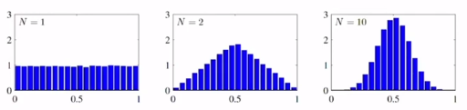
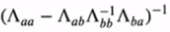

# [Week7 - Day2] 확률분포 2

## 1. 가우시안 분포
  - 정보 이론에서 엔트로피를 최대화시키는 확률분포
  - 중심극한 정리
  - 
  - 기하학적인 형태 
    - *D* 차원 벡터 **x**
      - 
    - \mu는 *D* 차원의 평균 벡터, \Sigma는 *D* * *D*  크기의 공분산 행렬
      - 파라미터로 주어진 확률밀도함수의 평균과 공분산
    - **x** 에 대한 함수적 종속성
      - 이차형식 
    - \Sigma - 대칭행렬로 간주 가능
      - \Sigma = *UT*\Lambda *U*
      - 
      - 이차형식
        - 
        - 벡터식으로 확장 : **y** = *U*(**x** - **\mu**)
          - **y**를 벡터들 *ui*에 의해 정의된 새로운 좌표체계의 점으로 해석 (기저 변환)
          - **x** - **\mu** : standard basis 좌표
          - **y** : *ui* basis 좌표
  - 정규화 증명
    - 야코비안 **J**
      - **y**의 확률밀도함수 계산에 필요
      - 
    - 행렬식 |\Sigma|를 고유값의 곱으로 표현가능
      - 
    - **y** 의 확률밀도 함수
      - 
    - **y**의 정규화
      - 
  - 기댓값 : *E*(**x**) = **\mu**
    - 다변량(Multivariate) 확률변수의 기댓값을 통해 증명
  - 공분산 : cov(**x**) = \Sigma
    - 2차 적률 (Second order moments) 계산
      - *E*(**xx***T*)
      - **x** = (**z** + **\mu**)로 치환
    - **z** 를 *UT* **y** 로 치환
    - *i* >< *j* 인 모든 경우 -> 영행렬
      - 
    - *E*(**xx***T*) = **\mu** **\mu***T*
    - cov(**x**) = *E*{(**x** - *E*(**x**))(**x** - *E*(**x**))*T*}

## 2. 조건부 가우시안 분포
  - *D* 차원 확률변수 벡터 **x**가 가우시안 분포 *N*(**x**|\mu, \Sigma)를 따름
    - 두 그룹으로 나누었을 때 한 그룹에 대한 나머지 그룹의 조건부 확률도 가우시안 분포를 따름
      - 공분산의 역행렬(정확도 행렬) 이용
      - 완전제곱식 방법
        - *p*(**x***a*, **x***b*) = *g*(**x***a*)\alpha로 표현
        - 
        - 이를 통해 *g*(**x***a*)를 탐색
        -  
          - const는 **x** 와 독립된 항들을 모아서 치환
          - 따라서 어떠한 함수라도 위와 같은 형태를 가지게 되면 \Sigma와 \mu를 가지는 가우시안 분포
  - 공분산
    - 
  - 평균벡터
    - 

## 3. 주변 가우시안 분포
  -  
  - 파티션을 위한 이차형식
    - 
  - **x***b* 를 포함한 항을 *f*(**x***b*, **x***a*), 그 외에서 **x***a*를 포함한 항을 *g*(**x***a*)로 묶음
  - *f*(**x***b*, **x***a*)를 완전제곱식으로 변형
  - \tau = 1/2 * *m**T* * \Lambda*bb*-1*m*
    - 
    - 이 값은 공분산 \Lambda*bb*에만 종속, **x***a*에 독립
    - 의 지수부에만 포커싱
  - \tau + *g*(**x***a*) + const
    - 
    - 공분산 
      - \Sigma*a* = 
      - Schur Complement에 의해 
        -  = \Sigma*aa*
    - 평균벡터
      - 

## 4. 가우시안 분포를 위한 베이즈 정리
  - *p*(**x**), *p*(**y**|**x**), *p*(**y**|**x**)의 평균은 **x**의 선형함수, 공분산은 **x**와 독립적
    - *p*(**y**), *p*(**x**|**y**) 계산 -> 선형회귀에 유용
      - **z** = [ **x** \ **y** ]를 위한 결합확률분포 계산
      - **z**의 이차항 계산
        - -1/2 * **z***T***Rz**
        - 
      - 공분산
        - 
      - 평균벡터를 찾기 위해 **z**의 1차항 정리
      - 평균벡터
        - 
      - **y**를 위한 주변확률분포 - 주변 가우시안 분포 적용
        - 평균 : *E*(**y**) = **A**\mu + **b**
        - 공분산 : cov(**y**) = **L**-1 + **A** \Lambda-1**A***T*
      - *p*(**x**|**y**) - 조건부 가우시안 분포 적용
        - 

## 5. 가우시안 분포의 최대우도
  - 가우시안 분포에 의해 생성된 데이터 **X**에 대해 우도를 최대화하는 파라미터를 탐색
    - 로그우도 함수
      - 
    - 우도를 최대화하는 평균벡터 **\mu***ML*
      - **y** = (**x** - **\mu**)로 치환
      - 
    - 우도를 최대화는 공분산행렬 \Sigma*ML*
      - 
    - (\Lambda*ML*)-1 = \Sigma*ML*, *h*(**X**) = **Y**가 일대일
      - *h*-1(**Y***) = **X*** 을 적용
        - \Lambda*ML* = argmin *l*(\Lambda)

## 6. 가우시안 분포를 위한 베이즈 추론
  - MLE법은 파라미터들의 하나의 값만을 계산
  - 베이지안법을 파라미터의 확률분포 자체를 게산
  - 우도함수
    - 
  - 사전확률
    - 
  - 사후확률
    - 