# [Week7 - Day3] 선형회귀

## 1. 선형 기저 함수 모델
  - 가장 단순한 형태의 선형모델
    - *y*(**x**, **w**) = *w0 + w1</
    sub>x1 + ... + wDxD*
    - 파라미터 **w** 뿐만 아니라 입력데이터인 **x**에 대해서도 선형
  - **x** 에 대해 비선형인 함수
    - 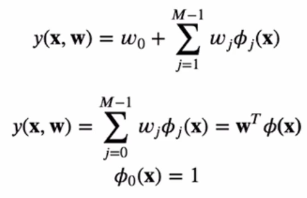
    - \phi(**x**)를 기저함수라 부름
    - ex)
      - 다항식 기저함수
        - \phi(*x*) = *xj*
      - 가우시안 기저함수
        - 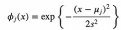
      - 시그모이드(Sigmoid) 기저함수
        - 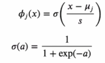

## 2. 최대우도와 최소제곱법
  - 에러함수가 가우시안 노이즈를 가정할때 최대우도로부터 유도 가능
  - *t* = *y*(**x**, **w**) + \epsilon
    - *y*(**x**, **w**) : 결정론적 함수
    - \epsilon : 가우시안 분포 *N*(\epsilon | 0, \beta-1)를 따르는 노이즈 확률변수
    - *t*의 분포
      - 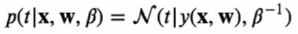
    - 조건부 기댓값
      - 제곱합이 손실함수로 사용되는 경우 새로운 **x**에 대해 *t*의 최적 예측값은 *t*의 조건부 기댓값
      - 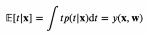
### 2-1 최대우도 추정법
  - 파라미터 **w** 탐색
  - 우도함수
    - 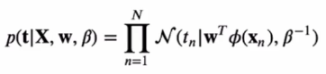
  - 로그 우도함수
    - 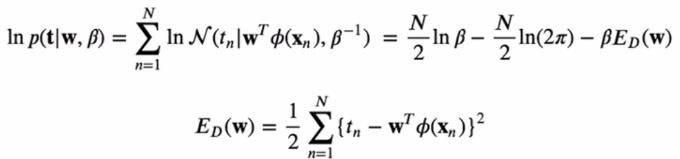
    - 로그 우도함수를 최대화시키는 **w** = 제곱합 에러함수 (*ED*(**w**))를 최소화시키는 **w**
  - **w**에 대한 기울기 벡터
    - 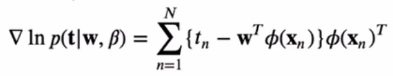
    - **w** 최적값
      - 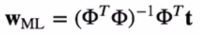
      - 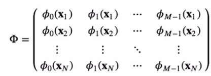
      - 정규 방정식 (Normal Equations)
        - 무어-펜로즈 유사역행렬
          - 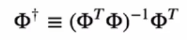

