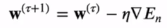
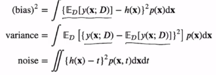

# [Week7 - Day3] 선형회귀

## 1. 선형 기저 함수 모델
  - 가장 단순한 형태의 선형모델
    - *y*(**x**, **w**) = *w0 + w1</
    sub>x1 + ... + wDxD*
    - 파라미터 **w** 뿐만 아니라 입력데이터인 **x**에 대해서도 선형
  - **x** 에 대해 비선형인 함수
    - 
    - \phi(**x**)를 기저함수라 부름
    - ex)
      - 다항식 기저함수
        - \phi(*x*) = *xj*
      - 가우시안 기저함수
        - 
      - 시그모이드(Sigmoid) 기저함수
        - 

## 2. 최대우도와 최소제곱법
  - 에러함수가 가우시안 노이즈를 가정할때 최대우도로부터 유도 가능
  - *t* = *y*(**x**, **w**) + \epsilon
    - *y*(**x**, **w**) : 결정론적 함수
    - \epsilon : 가우시안 분포 *N*(\epsilon | 0, \beta-1)를 따르는 노이즈 확률변수
    - *t*의 분포
      - 
    - 조건부 기댓값
      - 제곱합이 손실함수로 사용되는 경우 새로운 **x**에 대해 *t*의 최적 예측값은 *t*의 조건부 기댓값
      - 
### 2-1 최대우도 추정법
  - 파라미터 **w** 탐색
  - 우도함수
    - 
  - 로그 우도함수
    - 
    - 로그 우도함수를 최대화시키는 **w** = 제곱합 에러함수 (*ED*(**w**))를 최소화시키는 **w**
  - **w**에 대한 기울기 벡터
    - 
    - **w** 최적값
      - 
      - 
      - 정규 방정식 (Normal Equations)
        - 무어-펜로즈 유사역행렬
          - 
  - 편향 파라미터 (bias parameter) *w*0
    - 
    - \beta의 최적값
      - 
## 3. 기하학적 의미
  - 벡터의 집합에 대한 생성 (Span)
    - 
  - 행렬의 치역
    - *R*(**A**) = **A**의 모든 열들에 대한 생성
  - 벡터의 사영
    - span에 속한 벡터 중 **t**에 가장 가까운 벡터
      - 
    - Proj(**t**; **A**)는 행렬 **A**의 치역으로의 사영
    - **A**의 열들이 선형독립이면
      - 

## 4. 온라인 학습 (Squential Learning)
  - 배치 학습 vs. 온라인 학습
    - 에러함수 *E* = \Sigma{n}*En*
      - 
    - 제곱합 에러함수인 경우
      - 
      - \phi*n* = \phi(**x***n*)

## 5. 규제화된 최소제곱법 (Regularized Least Squares)
  - *ED*(**w**) + \lambda*EW*(**w**)
  - *EW*(**w**) = 1/2 * **w***T***w**, 
  - 최종 에러함수
    - 
  - **w**의 최적값
    - 
  - 일반화된 규제화
    - 
  - Lasso 모델 (*q* = 1)
    - Constrained Minimization 문제로 표현 가능

## 6. 편향-분산 분해 (Bias-Variance Decomposition)
  - 모델이 과적합되는 현상에 대한 이론적인 분석
  - 제곱합 손실함수가 주어질 때의 최적 예측값
    - 
    - 손실함수의 기댓값
      - 
    - 제한된 데이터셋만 주어져 있기 때문에 *h*(*x*) 정확히 계산 X
    - 파라미터화 된 함수 *y*(**x**, **w**)를 사용해 손실함수의 기댓값을 최소화
  - 제한된 데이터로 인해 발생하는 모델의 불확실성 표현
    - 베이지안 : 파라미터 **w**의 사후확률분포를 계산한다.
    - 빈도주의 : 파라미터 **w**의 점추정값을 계산, 평균적인 손실을 계산하는 '가상의 실험'을 통해 점추정값의 불확실성을 해석
    - 특정 데이터셋 *D*에 대한 손실
      - *L*(*D*) = {*y*(**x**; *D*) - *h*(**x**)}2
    - 손실함수의 기댓값
      - 
  - 여러 개의 데이터셋이 주어졌을 때 이 값의 평균
    - 
  - 손실 기댓값 = (편향)2 + 분산 + 노이즈
    - 

## 7. 베이지안 선형회귀
  - 파라미터 **w**의 사전확률 (가우시안 분포)
    - *p*(**w**) = *N*(**w**|**m**0, **S**0)
    - 우도 
      - 
      - 이를 통해 *p*(**w**|**t**) 탐색
    - 베이즈 정리를 적용
      - 
      - 
      - *S*0 = \alpha-1*I*, \alpha → 0 일 때  
        -> *S**N*-1 = 1/\beta * (\phiT\phi)-1  
        -> **m***N* = 1/\beta * (\phiT\phi)-1 * \beta * \phi*T***t**  
        = (\phiT\phi)-1 * \phi*T***t**
  - 사전확률을 사용하여 식을 단순화  
    - 
    - 사후확률
      - 
    - 사후확률의 로그값
      - 
      - 제곱합 에러함수 + 규제화 함수
      - 사후확률을 최대화시키는 **w** = 규제화가 포함됐을 때 에러함수를 최소화시키는 **w**
      - 베이지안 선형회귀 모델
        - 베이지안에 대해 특수한 상황일 때
  - 예측 분포
    - 새로운 입력 **x**에 대해 *t*를 예측
      - 
    - 이전 결과들을 적용
      - 
      - 

      