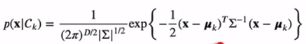

# [Week7 - Day4] 선형분류

## 1. 목표와 방법들
  - 목표
    - 입력벡터 **x**를 *K*개의 가능한 클래스 중에서 하나로 할당
  - 결정이론
    - 확률적 모델
      - 생성모델 *p*(**x**|*Ck*)와 *p*(*Ck*)를 모델링, 베이즈 정리를 사용해서 클래스의 사후 확률 *p*(*Ck*|**x**) 계산, 또는 결합확률 *p*(**x**, *Ck*)를 직접 모델링
      - 식별 모델 
        - *p*(*Ck*|**x**)를 직접 모델링
    - 판별함수
      - 입력 **x**를 클래스로 할당하는 판별함수를 탐색, 확률 계산 X

## 2. 판별함수
  - 입력 **x**를 클래스로 할당하는 판별함수를 탐색
  - 이진 분류
    - 선형 판별함수
      - *y*(**x**) = **w**T**x** + *w*0
      - *y*(**x**) >= 0 인 경우 *C*1 아닌 경우 *C*2으로 판별
    - 결정 경계
      - *y*(**x**) = 0
      - *D* - 1 차원의 hyperplane(**x** 가 *D*차원의 입력벡터)
  - 결정 경계면의 두점 **x***A*, **x***B*
    - *y*(**x***A*) = *y*(**x***B*) = 0
    - **w***T*(**x***A* - **x***B*) = 0 -> **w**는 결정 경계면에 수직
    - 벡터 **w**ㅗ
      - 원점에서 결정 경계면에 대한 사영
      - r * **w** / ||**w**|| = **w**ㅗ
      - *y*(**w**ㅗ) = 0
      - r = - *w*0 / ||**w**||
    - *w*0는 결정 경계면의 위치를 결정
      - *w*0 < 0 : 경계면이 원점에서 **w** 방향으로 멀어짐
      - *w*0 > 0 : 경계면이 원점에서 **w** 반대 방향으로 멀어짐
  - *y*(**x**)값은 **x**와 결정 경계면 사이의 부호화된 거리와 비례
    - **x** 의 결정 경계면에 대한 사영 **x**ㅗ
      - **x** = **x**ㅗ + r * **w** / ||**w**||
      - r = *y*(**x**) / ||**w**||
      - *y*(**x**) > 0 : **x**는 경계면 기준으로 **w** 진행방향에 존재
      - *y*(**x**) > 0 : **x**는 경계면 기준으로 -**w** 진행방향에 존재
      - *y*(**x**)의 절대값이 클 수록 거리 증가
    - 더미 인풋 *x*0 = 1 을 통해 식을 단순화
      - 
  - 다중 분류
    - 
    - j >< k 일때 *y**k*(**x**) > *y**j*(**x**) 를 만족하면 *Ck* 로 판별

## 3. 분류를 위한 최소제곱법
  - 
    - 행렬 \Tilde{*W*}를 사용한 표현
      - \Tilde{*W*} = {*w*1, *w*2, ..., *w**k*}
      - 
    - \Tilde{*W*}의 k번째 열
      - 
  - 제곱합 에러함수
    - 학습데이터 {**x***n*, **t***n*}로 이루어진 행렬 **T** (**t***n**T*), \tilde{**X**} (\tilde{**x***n**T*})
      - 
      - 
    - \tilde{**W**} 에 대한 *E**D*(\tilde{**W**}) 의 최소값
      - 
    - 판별함수
      - 
  - 단점
    - 극단치에 민감
      - 데이터가 결정 경계에서 멀리 있을수록 영향이 큼
    - 목표값의 확률분포에 대한 잘못된 가정에 기초
      - 목표값이 가우시안 분포를 따를 경우에만 적용가능

## 4. 퍼셉트론 알고리즘
  - *y*(**x**) = *f*(**w***T*\phi(**x**))
    - *f*는 활성함수, 퍼셉트론에서는 계단형 함수 사용
      - 
      - \phi(**x**) = 1
    - 에러함수
      - 
      - *t* \in {-1, 1}
      - if *t**n* = 1 -> **w***T*\phi*n* > 0, else *t**n* = -1 -> **w***T*\phi*n* < 0
          - **w***T*\phi*n**t**n* > 0
      - *M* 은 잘못 분류된 데이터들의 집합
  - Stochastic Gradient descent 적용
    - 
    - 업데이트 시 잘못 분류된 샘플에 미치는 영향
      - 
      - 
  - 차후 뉴런 모델의 기초

## 5. 확률적 생성 모델
  - 분류 문제의 확률적 관점에서 풀이
    - *p*(**x**|*C**k*)와 *p*(*Ck*)를 모델링한 후 베이즈 정리를 통해 클래스의 사후확률 *p*(*C**k*|**x**)를 계산
    - 판별함수 : 에러함수를 최소화시키는 최적의 파라미터 탐색
    - 확률적모델 : 데이터의 분포를 모델링하면서 문제를 해결
    - 
  - Logistic Sigmoid
    - \delta(-*a*) = 1 - \delta(*a*)
    - *a* = ln(\delta / (1 - \delta))
    - 
  - 연속적 입력
    - *p*(**x**|*C**k*)가 가우시안 분포를 따름, 모든 클래스에 대해 공분산이 동일
      - 
    - 클래스가 2개인 경우
      - *p*(*C*1|**x**) = \delta(*a*)
      - *a* 를 전개, **x** 에 관한 선형식으로 정리
        - 
    - 클래스가 *K* 개인 경우
      - 
  - 최대 우도해 (클래스가 2개인 경우)
    - 데이터
      - {**x***n*, **t***n*}, **t***n* = 1 -> *C*1, **t***n* = 0 -> *C*2
    - 파라미터들
      - *p*(*C*1) = \pi -> 구해야 하는 파라미터 \mu1, \mu1, \Sigma, \pi
    - 우도식 유도
      - *t**n* = 1
        - 
      - *t**n* = 0
        - 
      - 우도함수
        - 
    - \pi 구하기
      - 로그우도함수에서 \pi 관련항만 정리
        - 
      - \pi 에 관해 미분, 0으로 놓고 정리
        - 
        - *N*1 = *C*1에 속하는 샘플 수, *N*2 = *C*2에 속하는 샘플 수
    - \mu1, \mu2 구학;
      - \mu1 관련항 정리
        - 
      - \mu1 에 관해 미분, 0으로 놓고 정리
        - 
      - 유사한 과정을 \mu2 에 적용
        - 
    - \Sigma 구하기
      - 
      - 가우시안 분포의 최대우도를 구하는 방법을 적용
        - \Sigma = **S**
  - 입력이 이산값일 경우
    - 각 특성 *x**i* 가 0, 1 중 하나만 가질 수 있는 경우
    - 특성들이 조건부독립이라는 가정 -> 문제 단순화 (Naive-Bayes 가정)
      - *p*(**x**|*C**k*)를 분해
        - 
        - 
  - *p*(*C**k*|**x**)를 **x**의 선형함수가 Logistic Sigmoid 또는 Softmax를 통과하는 형태로 표현
    - 파라미터 계산을 위해 확률분포의 파라미터를 MLE로 계산
  - 대안법
    - *p*(*C**k*|**x**)를 **x** 에 관한 함수로 파라미터화, 직접 MLE를 계산
    - 이를 위해 입력벡터 **x** 대신 기저함수 \phi(**x**) 사용
  - 로지스틱 회귀
    - *C*1의 사후확률은 특성벡터 \phi의 선형함수가 Logistic Sigmoid를 통과하는 함수로 표현
      - 
    - \phi 가 *M*차원일 때 구해야 할 파라미터의 수는 *M*
      - 생성모델에서는 *M*(*M* + 5) / 2 + 1
    - 최대우도해
      - 
      - 우도함수
        - 
      - 음의 로그 우도
        - 
        - 
      - 이를 크로스 엔트로피 에러함수 (Cross-Entropy Error Function)라 칭함
    - 크로스 엔트로피
      - 주로 정보이론에서 사용
      - 일반적 정의
        - 
      - 이산확률변수의 경우
        - 
      - 크로스 엔트로피의 최소화 -> 두 확률분포의 차이 최소화
        - 에러함수 *E*(**w**) 의 최소화
          - 우도의 최대화
          - 모델의 예측값과 목표변수의(or 두개의 분포의) 차이를 최소화 
        

    