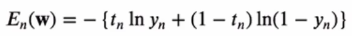
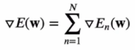
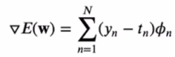
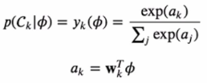
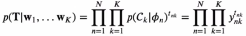
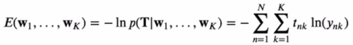
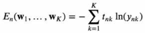
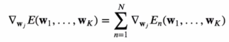
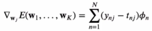

# [Week8 - Day1] 선형분류 2

## 1. 확률적 식별 모델
### 1-1 에러함수의 **w** 에 대한 미분(Gradient)
  - 에러함수 *E**n*(**w**)
    - 
    - 
  - *dE*(**w**)
    - 

### 1-2 다중클래스 로지스틱 회귀
  - 
  - 우도 함수
    - 특성벡터 \phi*n*을 위한 목표벡터 **t***n*는 클래스에 해당하는 하나의 원소만 1, 나머지는 0인 1-of-K 인코딩
      - 
    - 음의 로그 우도
      - 
    - **w***j*에 대한 미분
      - 하나의 샘플 \phi*n*에 대한 에러
        - 
      - *dE* / *d***w***j*
        - 
      - *E**n*와 **w***j*의 관계는 오직 *anj* 에만 의존
      - *En*은 *y**n*1 ~ *y**nK* 의 함수
      - *ynk*은 *a**n*1 ~ *a**nK* 의 함수
      - 

## 2. 선형 분류 실습 1
### 2-1 Gradient Descent (batch) - 경사 하강법
  - `sklearn.datasets.make_classification()` : 분류 학습에 사용하기 위한 군집 데이터를 생성
  - `compute_cost()` : 크로스 엔트로피 에러 함수
    - 수치적인 안정을 위해 1/N 을 곱함
  - `gradient_descent()` : 경사 하강법 함수
    - *X*, *t*, *w*
    - `learning_rate` : 경사 하강법에서 이동할 가로 거리
    - `iterations` : 반복 횟수
    - 반복 횟수동안 `w`를 업데이트
      - w - learning_rate * 1/*N* * \Phi*T*(*y* - *t*)
        - `w = w - (learning_rate/N) * (X.T @ (sigmoid(X @ w) - t))`
  - batch Update
    - 입력 데이터 전체를 사용하여 학습 1회 진행 후 결과를 업데이트하고 다음 학습에 사용
  - Acccuracy (정확도)
    - 모델의 절대적인 정확도 X
    - 테스트 데이터에 대한 정확도

### 2-2 Stochastic Gradient Descent - 확률적 경사하강법
  - 경사하강법 대비
    - 데이터 전체가 아닌 하나씩 사용하여 파라미터를 업데이트
  - 'sgd()` : 확률적 경사하강법 함수
    - `X` 대신 `X[i, np.newaxis]`를 사용하여 데이터를 하나씩 사용
  - 비용함수 그래프
    - Batch Update 대비 초반에는 비용함수가 들쭉날쭉하지만 학습이 진행됨에 따라 안정적인 모양을 찾음

### 2-3 Mini-batch Gradient Descent
  - Batch와 Stochastic을 합친 형태
  - 파라미터 업데이트에 사용할 데이터의 양을 선택하여 사용
  - `batch_gd()` : Mini-batch 함수
    - *X* 와 *t* 를 셔플한 후 데이터를 `batch_size` 만큼 잘라서 학습을 진행
    - batch 데이터가 epoch 경계를 넘으면 데이터의 앞부분을 사용하여 남는 자리를 채움
  - `batch_size` 값에 따라 학습의 효율성이 달라짐

## 3. 분류 문제 실습
  - MNIST 손글씨 숫자 분류 문제
  - 문제 단순화
    - 숫자 5에 대한 식별 문제로 간소화하여 이진 분류기 모델 적용
  - `AttributeError: 'str' object has no attribute 'decode'` 
    - 이진 분류기인 경우 solver='liblinear' 파라미터 추가하여 해결
    - 다중 분류인 경우 solver를 'newton-cg'로 변경하여 해결
  - 클래스간 데이터 양이 불균형인 경우 정확도는 좋은 지표 X
    - 오차 행렬 (Confusion Matrix)
      - `sklearn.model_selection.cross_val_predict()`
    - 정밀도(Precision) = TP / (TP + FP)
    - 재현율(Recall) = TP / (TP + FN)
  - Data Augmentation
    - 주어진 데이터를 조작하여 데이터의 양을 부풀리는 기술
    - 