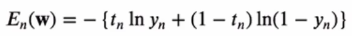
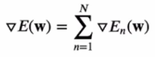
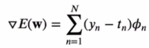
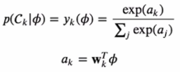
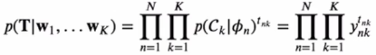
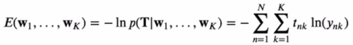
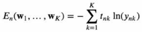
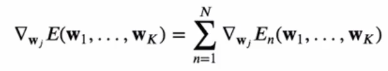
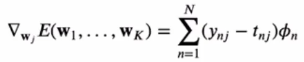

# [Week8 - Day1] 선형분류 2

## 1. 확률적 식별 모델
### 1-1 에러함수의 **w** 에 대한 미분(Gradient)
  - 에러함수 *E**n*(**w**)
    - 
    - 
  - *dE*(**w**)
    - 

### 1-2 다중클래스 로지스틱 회귀
  - 
  - 우도 함수
    - 특성벡터 \phi*n*을 위한 목표벡터 **t***n*는 클래스에 해당하는 하나의 원소만 1, 나머지는 0인 1-of-K 인코딩
      - 
    - 음의 로그 우도
      - 
    - **w***j*에 대한 미분
      - 하나의 샘플 \phi*n*에 대한 에러
        - 
      - *dE* / *d***w***j*
        - 
      - *E**n*와 **w***j*의 관계는 오직 *anj* 에만 의존
      - *En*은 *y**n*1 ~ *y**nK* 의 함수
      - *ynk*은 *a**n*1 ~ *a**nK* 의 함수
      - 
